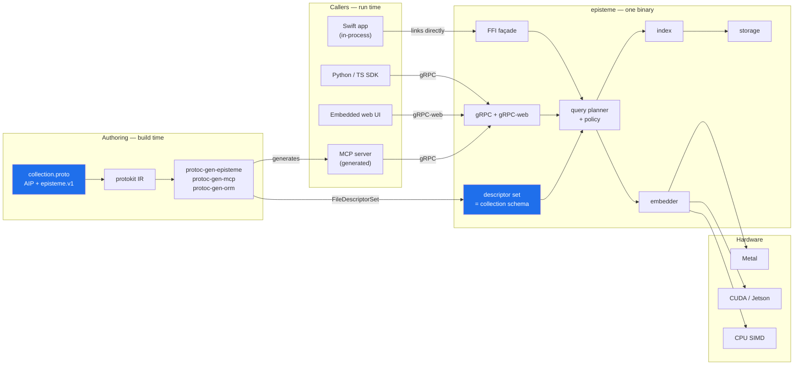
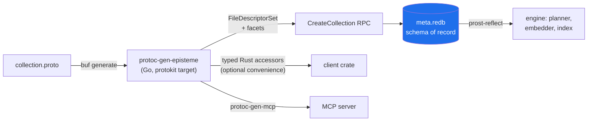
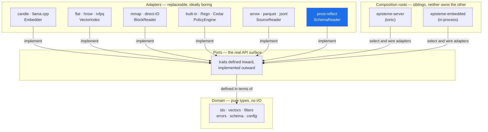
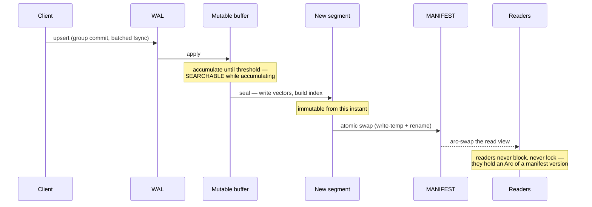
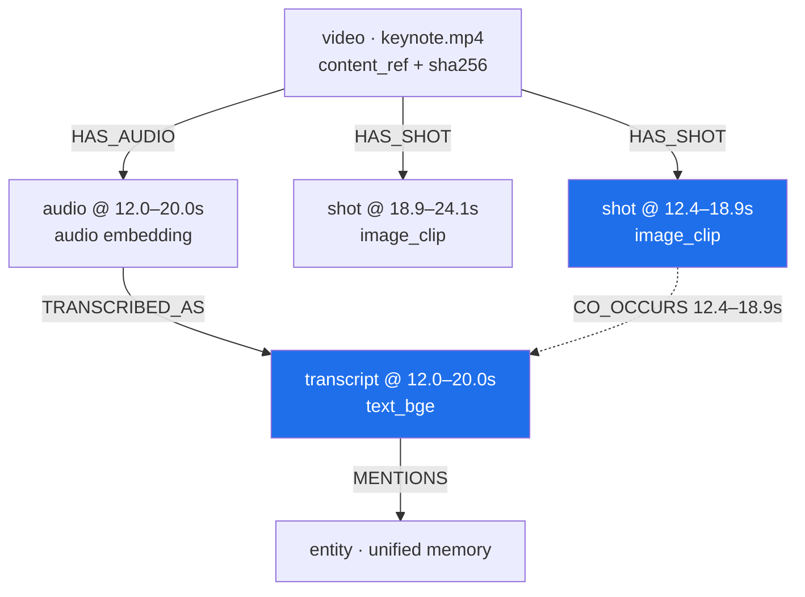
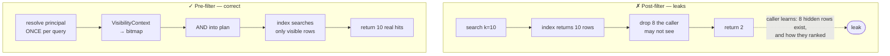
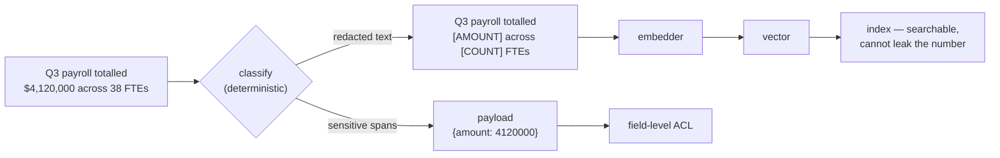
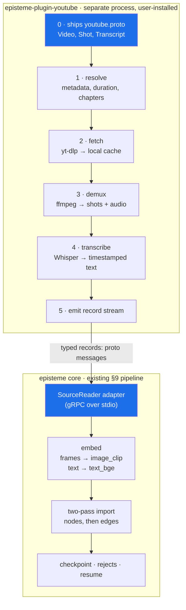
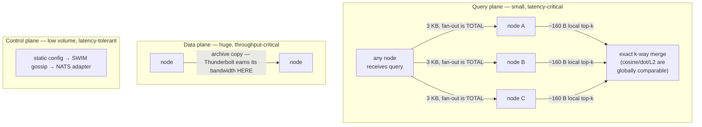

# episteme — Architecture

A single-node-first, embeddable **multimodal vector and graph database** written in Rust, with a
gRPC interface, pluggable embedding models loaded from GGUF, and pluggable search algorithms —
whose **schema is a `.proto` file**.

episteme is a member of [The Protobuf Project](https://the-protobuf-project.org) ecosystem. It is
the vector-and-graph projection of the same annotated `.proto` that already yields the Postgres
schema, the Prisma project, the GORM stores, the on-chain contracts and the MCP tool surface. That
relationship is not decoration; it is §2, and it constrains the segment format, the query planner,
the plugin system and the app layer.

This document consolidates the design as it stands. `CLAUDE.md` holds the working rules;
`AGENT_START.md` holds the phased plan and the detailed rationale.

**Read in this order if you are new:** §1 (what this is) → §2 (the schema layer, because everything
downstream assumes it) → §15 (the honest list of what has *not* been decided) → §17 (where to start
building). §19 records what changed in this revision and why, and is the fastest way to diff this
against the previous draft.

---

## 1. What this is

Three properties define the system; everything else follows from them.

**Bring your own schema.** A collection is defined by an AIP-annotated `.proto`. Point types, edge
types, payload columns, named vector fields, temporal spans, content references and per-field
permissions are all annotations. There is no second schema language and no TOML fallback — this is
a hard commitment, and §2.5 lists what it removes from the design.

**Bring your own embedding model.** Point a schema at a GGUF file. Inference runs inside the
database on whatever accelerator the host has — Metal, CUDA, Jetson, Intel, CPU.

**Bring your own search algorithm.** ANN indexes sit behind a trait. The bundled ones are not
privileged.

Plan A is the vector store. Plan A1.1 layers a property graph over the same storage — which is also
what joins modalities (§5), making this a general retrieval substrate for agents rather than a text
index with extras.

**Target scale for v1 is 100M+ vectors, server-first.** Embedded mode (§12) is a first-class
deployment, not the only one. That answer is load-bearing: it means real ANN is required rather than
optional, in-memory HNSW may not suffice at the top of the range, and the distribution rules in §14
must stay open rather than be deleted.



---

## 2. The schema is the index

This is the section that distinguishes episteme from every other vector store, and the one that
most constrains the rest of the document. Read it before §4.

### 2.1 Why the schema comes from a `.proto`

The ecosystem thesis is that a `.proto` annotated with Google AIP already states what a resource is,
which fields are required, and how resources relate — and that the database, the API, the tool
surface and the on-chain state are all *projections* of that one statement rather than four
independent restatements of it. protokit does the backend-agnostic work once: it walks the
descriptor set, honours the AIP annotations, and builds a normalized IR of databases, tables,
columns, relations, enums and indexes. A generator supplies only two things — how to read its own
annotations, and how to render.

There is no vector-and-graph projection in that ecosystem. episteme is it.

The practical consequence is that **a property the previous draft had to invent, episteme now
inherits**:

| The design needed | Where it now comes from |
|---|---|
| A typed graph ontology (was Gap 16) | AIP resources are node types; `resource_reference` fields are edges |
| Namespaced, additive ontology fragments (was §8.6) | Proto packages — already namespaced, already additive, already linted |
| A filter expression language (was `FilterExpr`) | **AIP-160**, which the ORM target already emits |
| A schema-version fingerprint for segments | The descriptor-set hash, mirroring the `SCHEMA_VERSION` pattern the web3 generator uses to refuse a drifted contract |
| An MCP bridge (was one box in §1) | `protoc-gen-mcp`, which already emits a Rust server |
| Schema-evolution rules | Protobuf's own compatibility rules |

### 2.2 `episteme.v1` — the facet vocabulary

Following the ownership lesson protokit learned the hard way — the neutral naming vocabulary
`entity.v1` lives in the `store` repo, not in protokit, because a persistence-shaped vocabulary
inside a neutral engine makes the neutral engine a persistence engine — **`episteme.v1` lives in the
episteme repo**, is published to the buf registry, and ships its reader as a nested module that
imports protokit and nothing else from episteme. Any plugin can consume the vocabulary without
pulling a vector database along with it.

`episteme.v1` reads *only* what is specific to vector and graph retrieval. Names, tables, columns,
relations and indexes come from `entity.v1` and AIP, via the same reader every other generator uses.

```protobuf
option (entity.v1.datasource) = { database: "media" };

// A node type. One AIP resource == one point type.
message Shot {
  option (google.api.resource) = {
    type:    "media.episteme.dev/Shot"
    pattern: "recordings/{recording}/shots/{shot}"
  };
  option (entity.v1.table)     = { id: ID_STRATEGY_ULID, timestamps: true };
  option (episteme.v1.point)   = { collection: "media" };

  // AIP resource name — the external identity (§9, rule 1).
  string name = 1 [(google.api.field_behavior) = IDENTIFIER];

  // A resource_reference IS a graph edge. No separate edge declaration.
  string recording = 2 [
    (google.api.resource_reference) = { type: "media.episteme.dev/Recording" },
    (episteme.v1.edge) = { type: "HAS_SHOT", direction: INBOUND, on_dangling: DEFER }
  ];

  // Temporal span (§5.2) — makes this point addressable as a moment.
  episteme.v1.Span span = 3 [(episteme.v1.span) = { unit: MILLISECONDS }];

  // Content reference, not the blob (§5.3).
  episteme.v1.ContentRef content = 4 [
    (episteme.v1.content_ref) = { inline_below_bytes: 4096, hash: SHA256 }
  ];

  // A named vector field. Everything the index and the embedder need.
  bytes image_clip = 5 [(episteme.v1.vector) = {
    model:         "siglip-base-patch16.gguf"
    dim:           512
    metric:        COSINE
    quantize:      SQ8
    index:         HNSW
    query_encoder: "siglip-base-patch16.mmproj.gguf"   // the text tower — see below
    permission:    "vector.image_clip"                 // Gap 11, now expressible
  }];

  // Redaction is declared, deterministic, and enforced in core (§7).
  string caption = 6 [(episteme.v1.redact) = { rules: ["AMOUNT", "PERSON"] }];
}
```

**`query_encoder` is the highest-value annotation in the set.** §5.1 observes that searching an
image field with a text query must encode that text with the joint model's *text tower*, and that
getting it wrong yields silently garbage results rather than errors. As a runtime convention that is
a permanent footgun. As a field annotation it is checkable by the AIP linter in CI and visible in
the VS Code proto tree, before a single vector is written.

### 2.3 What the target reads from the IR, and what it ignores

`protoc-gen-episteme` is an ordinary protokit generator: a facet reader, a layout resolver, and a
target. It projects the neutral IR as follows.

| IR node | Projected to | Notes |
|---|---|---|
| Database / schema | Collection | Same name the ORM target derives — enforced by `golden.IRAgreement` |
| Table | Point type | One AIP resource, one node type |
| Column (`schema.FieldType`) | `payload.arrow` column | Neutral type projected onto Arrow, exactly as Postgres projects onto SQL |
| Relation (FK / `resource_reference`) | Edge type | Direction and dangling policy from the `episteme.v1.edge` facet |
| Index | Payload filter index | Feeds selectivity estimation (§6) |
| `id_strategy`, `timestamps` | External identity, audit columns | See §2.4 on the ids.bin consequence |
| **Ignored** | SQL types, DDL, migrations, referential actions | Storage-specific to the relational target |

**Run `golden.IRAgreement(t, caseDir, ormPlugin, epistemePlugin)` in CI.** That harness builds the IR
under both plugins' readers and asserts identical database, schema, table and column names plus key
resolution, naming the diverging node on failure. It exists precisely to stop a second generator
silently disagreeing with the first, and episteme is that second generator. `golden.Determinism`
applies equally — generating twice and byte-comparing catches the map-ranged-into-output bug a
committed golden file cannot.

### 2.4 The descriptor set *is* the collection schema, at runtime

This is the crux design decision, and it resolves the Go/Rust split.

protokit is a Go library. episteme is Rust. Generated-at-build-time Rust structs cannot be the whole
answer, because a caller creating a collection at run time cannot recompile the database. So:

> **The engine never parses `.proto`. It consumes `FileDescriptorSet` bytes only.**

`CreateCollection` takes a serialized `FileDescriptorSet` plus the `episteme.v1` facets carried as
extensions on it. That blob is stored in `meta.redb` and is the authoritative schema. The Rust side
needs descriptor reflection (`prost-reflect`), not a reimplementation of protokit.



Three consequences worth stating plainly:

**External identity becomes an AIP resource name, not an opaque u64.** §9's rule that external IDs
are the only portable identity now has a concrete form: `recordings/kn24/shots/00412`. Internally,
`ids.bin` still holds fixed-stride u64 ordinals — they key an interned resource-name dictionary in
`meta.redb`. This is a **Phase 1 segment-format change** and the reason §2 must be settled before
§4 is implemented. It also makes archives (§9) self-describing across systems, since a resource name
means the same thing to the Postgres projection.

**Segments carry a schema fingerprint.** `header.bin` gains `schema_fingerprint` — the hash of the
canonicalized descriptor set — plus a *per-vector-field* `model_fingerprint`. Two hashes rather than
one, because named vectors are independently stored (§5.1): changing the model on `image_clip`
should invalidate that field's vectors and nothing else. A segment whose fingerprint differs from
the collection's current one is readable if the difference is additive and rejected otherwise. This
mirrors the pattern the web3 generator already uses, where a client refuses a deployed contract
whose storage-layout fingerprint drifted from the one it was generated against.

**Schema evolution is protobuf's problem, already solved.** Adding a field means new segments carry
it and older ones do not — which the presence bitmap (§5.1) already handles, since it was built for
points that lack a modality. Removing a field means `reserved`. Changing a vector field's model is
*a new field*, not a mutation, which keeps immutability honest. Protobuf's compatibility discipline
and immutable segments turn out to be the same discipline, and this alignment is the strongest
evidence the integration is the right shape rather than a convenient one.

### 2.5 What this deletes

The integration is only worth taking if it subtracts. It does:

| Removed | Replaced by |
|---|---|
| `[emits] node_types / edge_types` in the plugin manifest (old §8.4) | The plugin ships a `.proto`; its package *is* the namespace |
| Ontology fragments and their composition rules (old §8.6, §9.5) | Proto packages — namespaced and additive by construction |
| `[collection]` and `[ontology]` blocks in the app manifest (old §9.1) | The app ships a `.proto` |
| A bespoke `FilterExpr` type, parser and fuzzer | AIP-160 |
| A hand-written MCP bridge | `protoc-gen-mcp` |
| **Gap 16** (typed graph ontology) | Resolved |
| Half of **Gap 11** (per-field permissions) | The `permission` field annotation; only enforcement remains |

Roughly a fifth of the previous draft. The app and plugin manifests survive, but shrink to what they
are actually for: **capabilities, pinned versions and pipeline wiring** — never schema.

### 2.6 AIP-160 is the filter language, with one documented extension

§6's planner takes a metadata predicate. That predicate is AIP-160, the same filter grammar the GORM
target already emits, so a caller writes one filter syntax whether the resource lives in Postgres or
in episteme.

**The known gap: AIP-160 has no interval-overlap operator**, and §5.2's temporal spans need one
(Gap 9). AIP-160 does admit function calls, so the extension is expressible —
`span.overlaps(12400, 18900)`, `span.contains(t)`, `span.within(other)` — but the function set must
be *defined once, documented, and shared with the linter*, not accreted. Define it in Phase 5 with
the planner, not later.

Policy interacts here too: §18's open question about `regorus` partial evaluation becomes "does the
residual lower into AIP-160," which is a better-posed question because AIP-160 has a published
grammar and existing implementations to lower into.

### 2.7 What the integration costs

Stated honestly, because these are real and none of them is fatal:

- **A second toolchain in the authoring loop.** `buf` and Go are needed to author a schema, though
  not to `cargo build` the engine. The no-C-dependency invariant is untouched; the
  no-second-language invariant is not, and never was — `protoc-gen-mcp` already emits Rust.
- **runtime-rs is client-side today** — HTTP, GraphQL and WebSocket clients with a typed predicate
  DSL, not a server engine. episteme would be the first serious Rust *server* in the mesh. That is
  an opportunity and a cost: some runtime-rs maturation is on this critical path.
- **`store.Driver` fits the CRUD half only.** Get, list, create and AIP-160 filtering map cleanly.
  Nearest-neighbour search does not, and should not be bent into it. episteme implements the driver
  *and* exposes a search surface beyond it. Say so; do not imply k-NN is CRUD.
- **`CreateCollection` now takes a blob a human cannot hand-write.** The CLI must make
  `buf generate && episteme collection create` a one-liner, or the ergonomics regress badly against
  every competitor's `create_collection(dim=768)`.

---

## 3. Structural principles

The codebase is **ports and adapters**, applied for practical benefit rather than doctrine, with a
hard rule that **no file exceeds 200 lines** including documentation. Both are enforced in CI
(`cargo xtask check-len`, `check-layers`), because rules that depend on discipline decay.

Dependencies point **inward**. `core` knows about no I/O. Adapters plug in from outside and are
wired exactly once, in a composition root.



**Why the two composition roots are siblings:** the Swift API links `episteme-embedded` with no
server present. If `episteme-server` were the parent, embedding would drag in tonic and tokio for
nothing — and, far worse, anything enforced in the gRPC handlers would be bypassable. That single
observation drives §7.

**`SchemaReader` is a port, not a core type.** Descriptor reflection is I/O-shaped and version-bound;
core sees a resolved `CollectionSchema` of pure domain types. This keeps `prost-reflect` out of the
domain and leaves room for a second schema source later without touching the planner.

---

## 4. Storage

Segments are **immutable once sealed**, memory-mapped, and self-describing. This is the load-bearing
decision: it is what makes reads lock-free, `mmap` safe, snapshots free, and sharding possible later.

```
data/<collection>/
├─ MANIFEST                  # atomic pointer to the current segment set; swap = write-temp + rename
├─ MANIFEST.<n>              # prior versions → snapshot reads and time-travel come free
├─ wal/000123.wal            # append-only, crc32c framed, group commit
├─ meta.redb                 # schema descriptor set, resource-name dictionary,
│                            # ID map, graph edges  (pure-Rust ACID KV)
└─ segments/seg_00001/
   ├─ header.bin             # magic, version, schema_fingerprint, counts, codec, metric
   ├─ vectors/<field>/       # one directory per named vector field (§5.1)
   │  ├─ raw.bin             # full-precision vectors — fixed stride, 64B aligned   [mmap]
   │  ├─ codes.bin           # quantized codes for the wide scan                    [mmap]
   │  ├─ index.hnsw          # serialized graph, offset-addressed                   [mmap]
   │  ├─ present.roar        # presence bitmap — not every point has every field
   │  └─ model.fingerprint   # per-field model provenance (§2.4)
   ├─ ids.bin                # u64 ordinals → interned resource names in meta.redb  [mmap]
   ├─ spans.bin              # temporal spans, fixed stride                         [mmap]
   ├─ payload.arrow          # columnar attributes for filtering                    [mmap]
   └─ deletes.roar           # roaring tombstones — the one mutable sidecar
```

**Big and immutable → mmap'd flat files. Small and mutable → `redb`.** Putting vectors in an LSM
store fights the engine: it copies, compacts, and fragments the fixed-stride array that SIMD scans
depend on. The descriptor set and the resource-name dictionary are small and mutable-ish, so they
live in `redb`; the vectors never do.

**Two-tier vectors are the highest-leverage decision here.** Scan wide and cheap over `codes.bin`,
then rescore the survivors at full precision from `raw.bin`. This is a *storage* decision that
buys more recall-per-byte than any index tuning.

**"Self-describing" now means something stronger.** A segment header names the exact schema
fingerprint it was written under, and each vector field names the exact model. A segment copied to
another machine carries enough to be validated, not merely parsed. That property is what makes §9's
archives and §14's replication safe rather than hopeful.

### 4.1 The write path



A reader holding an older manifest keeps a consistent view until it drops it. That is snapshot
isolation, and it costs nothing extra — it falls out of immutability.

**The mutable buffer must be searchable, and the previous draft did not say so.** Every query
brute-force scans the unsealed buffer and merges those hits with the segment results before top-k
selection. At 100M-scale bulk import this is a minor cost; for any streaming or interactive ingest
it is the difference between a write being visible immediately and being invisible until a threshold
trips. Because it changes the planner and the merge step, it is a **Phase 1 decision, not a later
optimization**. Recall accounting must include it: the buffer scan is exact, so it can only improve
recall, but the reported statistics (§15, Gap 4) must distinguish buffer hits from index hits or
recall measurement will read as noise.

---

## 5. The multimodal data model

The system is not text-only. Images, audio and video are first-class, and **the graph is what joins
them** — that is what makes this a general retrieval substrate for agents rather than a text index
with extras.

There are two distinct ways to be multimodal, and the design supports both because they solve
different problems:

| | **Shared space** | **Graph-joined spaces** |
|---|---|---|
| How | One jointly-trained model (CLIP/SigLIP) embeds image and text into the *same* space | Each modality keeps its own model, dimension and metric |
| Cross-modal retrieval | Falls out of the geometry — search images with text | Happens by **traversal**, not distance |
| Needs | A joint model to exist for your modalities | Nothing — works for any combination |

Shared space is elegant where a joint model exists. Graph-joined is general, and it is the one that
makes audio↔video↔text work today, because no single model covers all three well.

### 5.1 Named vectors — one point, several spaces

A point carries **named vector fields**, each with its own model, dimension, metric and index. Each
is a `bytes` field in the `.proto` carrying an `episteme.v1.vector` facet (§2.2):

```
point "recordings/kn24/shots/00412"
├─ vectors
│  ├─ image_clip   dim 512  · SigLIP · cosine · query_encoder: siglip text tower
│  └─ text_bge     dim 768  · bge-large · cosine · query_encoder: self
├─ span            { start_ms: 12400, end_ms: 18900 }
├─ content         { uri: "s3://…/keynote.mp4", range: …, sha256: … }
└─ payload         { speaker: "…", scene: "…" }
```

The segment layout in §4 extends cleanly, since each named vector is independently stored, quantized,
indexed and fingerprinted.

**Not every point has every modality**, so each field carries a **presence bitmap** — the same
roaring machinery as tombstones. A text-only document simply has no `image_clip` row. This is also
what makes additive schema evolution free (§2.4): a field added last week is simply absent from
segments sealed last month.

**This keeps the graph inside a collection**, which preserves the §7 resource model intact: one
collection, many vector spaces, edges that never have to cross a security boundary.

**Cross-modal query routing is a schema property — and now a checkable one.** Searching `image_clip`
with the text `"a red car"` must encode that text with **SigLIP's text tower**, not with bge. The
`query_encoder` annotation declares it, the linter checks it, and the planner has no discretion. Get
this wrong and results are silently garbage rather than erroneous, which is exactly the class of bug
that belongs in a schema rather than in a convention.

### 5.2 Time is part of the identity

Video and audio are **time-indexed**, and this is the part that is easy to miss. A 90-minute video
is not one embedding. Retrieval must return *a moment in a video*, not a video.

So media points carry a **temporal span** — an `episteme.v1.Span` field, stored fixed-stride in
`spans.bin` — and the graph expresses how spans relate across modalities:



Every edge above is a `resource_reference` field carrying an `episteme.v1.edge` facet. The ontology
is the proto package; there is no separate registry.

A query matches the transcript; traversal reaches the shot that was on screen while it was said,
and the parent video for context. **That is the retrieval pattern the graph exists to serve** — and
it is the same parent-child mechanism that good text chunking wants (Gap 14), arriving for free.

**Design guidance on point boundaries:** use one point per *addressable retrieval unit*. Where
representations are co-extensive — a shot and its visual embedding — one point with several named
vectors. Where boundaries differ — transcript chunks rarely align with shot cuts — separate points
joined by edges. Forcing misaligned boundaries into one point loses precision at both ends. In proto
terms: one message per retrieval unit, and let `resource_reference` carry the relationship.

### 5.3 The database does not store blobs

**Points hold a content reference, not the media** — an `episteme.v1.ContentRef`: URI, byte range,
and a content hash.

Video is GB-scale; segment files are built for fixed-stride vectors. Blob storage is a solved
problem and this is not the system to re-solve it in. The content hash matters independently: it is
how you detect that a source changed and its embeddings are stale.

**This settles Gap 1.** The general rule is *store a content reference always; inline the source
only when it is small* — and the threshold is now a field annotation
(`inline_below_bytes`) rather than a global setting, which resolves the "per-collection or per-field"
half of that gap by making it per-field with a collection-level default. Text chunks are inlined and
remain re-embeddable; video is referenced. Model migration stays possible for everything whose
source is still reachable.

### 5.4 Media decoding stays outside the core

Honest scope boundary: **episteme is a vector and graph database, not a media pipeline.**

Decoding is real work that has nothing to do with vector search — image decode and resize
(`image`), audio resample (`symphonia`, pure Rust), and video demux and frame extraction, which in
practice means **ffmpeg**. That collides directly with the no-C-dependencies invariant.

So the boundary: **the database accepts frames, samples and vectors — not MP4s.** Media
preprocessing lives in a sibling ingest tool or an opt-in crate, quarantined the same way the
llama.cpp backend is. This keeps `cargo build` toolchain-free and keeps the core focused.

Note the invariant as actually stated: *the core builds with no C toolchain.* Backends may be
quarantined behind features — `whisper.cpp` for §16's first slice is one, and it is worth naming
that the first slice already exercises the quarantine rather than avoiding it.

### 5.5 The embedding reality is harder than for text

GGUF coverage for multimodal is materially thinner than for text, and this is the main risk in this
expansion:

| Modality | Practical path | Maturity |
|---|---|---|
| Text | GGUF encoder (bge, e5, gte) | Solid |
| Image | CLIP/SigLIP — GGUF exists via vision-tower `mmproj` files; candle has CLIP | Workable |
| **Audio** | **Whisper → text → text embedder** | **Solid, and the pragmatic choice** |
| Audio (direct) | CLAP-style embeddings | Thin GGUF support |
| Video | Sample frames → CLIP per shot; no direct video model in GGUF | Assembled, not off-the-shelf |

The audio row is the useful insight: **transcribing then embedding text is far more reliable than
direct audio embedding**, and it produces a transcript that is independently valuable for the graph.
Reach for direct audio embeddings only for non-speech audio.

This is also where `RemoteEmbedder` earns its place — the escape hatch for "my model isn't GGUF" is
load-bearing for multimodal in a way it never was for text. It is declared like any other model, in
the `episteme.v1.vector` facet, so provenance is recorded identically whether inference is local or
remote.

### 5.6 Fusion is shared machinery

Combining results across modalities is rank fusion — reciprocal rank fusion over per-field result
lists. **This is the same mechanism hybrid sparse+dense retrieval needs (Gap 2).** Build it once,
and it serves both. That materially lowers the cost of Gap 2.

---

## 6. Query path

Three strategies for combining a metadata predicate with ANN search, chosen by estimated
selectivity. Post-filtering a selective predicate returns fewer than `k` results, so this needs a
planner rather than a convention.

| Selectivity | Strategy |
|---|---|
| < 1% pass | Build the bitmap, **brute-force** just those rows |
| 1–20% | **Filter-aware traversal** — skip excluded nodes during descent |
| > 20% | **Post-filter** with an over-fetch multiplier |

**The predicate is AIP-160** (§2.6), parsed once and lowered into a bitmap or a traversal guard.
Selectivity estimates come from the payload indexes declared in the schema, which protokit's index
pass already resolves and validates.

Every plan additionally scans the unsealed mutable buffer (§4.1) and merges before top-k, and ANDs
in the visibility predicate (§7) before the index runs — in that order, and never after.

---

## 7. The security model

Authorization is not a late feature here; it constrains the query path, and retrofitting it into a
planner is painful.

**The mechanism that matters: the visibility predicate is ANDed into the plan *before* the index
runs.** Post-filtering is not merely slower — it is a data leak.



Two rules make this hold everywhere:

**Policy is enforced in the query planner, not the transport.** The gRPC layer resolves a principal
from credentials and hands it down; it makes no access decisions. Otherwise the embedded Swift API
(§12) would bypass authorization entirely. Embedded callers supply a principal too —
`Principal::Owner` in the trivial case — so there is exactly *one* enforcement path to audit.

**One predicate, every access path.** A row reached by three-hop graph traversal is checked by the
same predicate as one reached by top-k. The graph is the subtle leak: visibility must be re-checked
at **every hop**, not just at the seed set.

Actions are deliberately fine-grained, because in a vector database they are not equivalent —
`search` and `read_vector` are **separate permissions**, since embedding inversion can reconstruct
approximate source text from a raw vector. That also makes `export` high-privilege: it is
`read_vector` over everything.

### 7.1 Permission scopes are declared in the schema

Gap 11 asked for per-field permissions. Half of that is now schema: the `permission` field on
`episteme.v1.vector`, and an equivalent on `content_ref`, names a scope. A grant then attaches to
`vector.image_clip` rather than to the whole collection, so "search the transcripts, deny the
voiceprints" and "search transcripts, deny the source video" are both expressible.

What remains is enforcement — resolving those scopes into the visibility predicate at plan time, and
re-checking them per hop. That is Phase 6 work, but the vocabulary must exist in Phase 1 or the
annotations will be retrofitted onto a sealed format.

**Node-type grants fall out too.** Because a node type is an AIP resource, a grant can name
`media.episteme.dev/Transcript` without any new machinery — which is the remaining half of old
Gap 16, now trivial.

### 7.2 Confidentiality: the vector is the leak, and redaction is the fix

Redacting the payload is useless if the vector was computed from the sensitive text.



The document stays findable; the number was never in the vector. **No cryptography available to
this project achieves this, and redaction achieves it completely.**

The rules applied are declared per field via `episteme.v1.redact` (§2.2), which means redaction is
reviewable in the schema diff rather than buried in configuration.

A hard rule attaches: **a probabilistic classifier never gates a security boundary.** Regex, NER
and schema-declared sensitivity enforce. An LLM proposes labels for approval. A 98%-accurate
detector leaks 2% silently, forever.

### 7.3 What cryptography can and cannot do

| Threat | Mitigation | Crypto? |
|---|---|---|
| Overbroad retrieval | Mandatory pre-filter, partition by collection | No |
| Payload leakage | Field projection allowlist | No |
| Vector inversion | Separate `read_vector` permission | No |
| **Similarity probing** — infer content from scores | Ranks not scores, quantize, rate-limit, audit | No |
| Stolen disk | Encryption at rest, per-collection keys, crypto-shredding | **Yes — easy** |
| Untrusted host | TEE with attestation | **Yes — hard** |

**Encrypted search is rejected.** FHE is 10⁴–10⁶× too slow *and* destroys the index (graph
traversal is data-dependent; every comparison would need decryption, forcing a linear scan).
Order-preserving encryption is broken for this use. A secret orthogonal transform is fast and
preserves inner products exactly — but it is linear, so ~d known plaintext pairs recover it, and
the geometry survives regardless. It is obfuscation, and must never be described otherwise.

---

## 8. Vaults — secrecy at the user level

§7 is organizational: roles, grants, predicates, enforced by the server on behalf of an operator.
A **vault** is different in kind — it is content a *user* keeps secret, where the question is not
"may this principal read it" but "**can the operator read it at all**."

### 8.1 Say what is actually being guaranteed

The word "vault" carries an implication that must be earned. Three models, and they are not
interchangeable:

| Model | Operator can read? | Server-side search? | Honest name |
|---|---|---|---|
| Row predicate `owner = principal` | **Yes** | Yes | a **private collection** — not a vault |
| Key unwrapped into a session on auth | **Only while a session is live** | Yes | a **vault** |
| Key never leaves the user's device | **No** | **No** | a **sealed vault** |

**Calling the first one a vault is the failure mode to avoid.** It is ordinary access control, and
labelling it as secrecy is how people put things somewhere they believed was private and were
wrong. Product language must match the guarantee, exactly.

### 8.2 The wall, restated

The constraint from §7 applies again, and it is absolute: **a vault the server cannot read is a
vault the server cannot search.** Distance computation over ciphertext is the encrypted-search
problem, and the answer there was no.

So the design has two honest shapes, and which one a user gets depends on where the key lives:

**Session-unwrapped (`mode = "session"`)** — the practical default for a server deployment. The user
authenticates, the vault key is unwrapped into process memory for the life of that session, vault
segments decrypt into the session and are searched exactly like any other collection, and the key is
destroyed at logout. At rest, the operator has ciphertext. **While a session is live, an operator
with memory access could read it** — state this plainly rather than implying otherwise.

**Sealed (`mode = "local"`)** — the key never leaves the user's device, so no server can search the
vault. This is not a degraded option: **it is the natural mode for embedded deployments (§12)**,
where the client *is* the database, running in-process on the user's own machine. There is no
untrusted server, so there is nothing to defend against, and a personal vault is small enough that
exhaustive search over it costs nothing. Zero-knowledge secrecy is genuinely achievable here in a
way it never is against a remote server.

### 8.3 A vault is a collection, not a new subsystem

This reuses machinery that already exists rather than adding a parallel path. Vault configuration is
*deployment* config, not schema — it names keys and modes, which belong nowhere near a `.proto`:

```toml
[collection.vault]
owner   = "users/srikanth"
mode    = "session"          # session | local
key     = "keychain://episteme/vault/srikanth"   # or argon2id-from-passphrase
```

Per-collection encryption keys already exist (§7). A vault simply **wraps that key with a
user-held key** instead of the server keyring. Everything downstream is unchanged: crypto-shredding
still works (destroy the wrap, the vault is unrecoverable), archives still export, segments are
still immutable.

### 8.4 A locked vault must be visible as a gap, not a silence

When a vault is locked, it contributes zero rows to the pre-filter. The tempting implementation is
to skip it silently — and that is wrong, because the user cannot distinguish "no results" from "no
results *you can currently see*."

**Reuse the completeness fields from §14.** The same mechanism that reports a shard missing its
deadline reports a locked vault:

```protobuf
SearchResponse {
  repeated Hit hits      = 1;
  bool  complete         = 2;   // false — a vault was locked
  uint32 shards_answered = 3;
  uint32 shards_total    = 4;
  repeated string locked_vaults = 5;   // resource names only, never contents
}
```

That those fields were added in Phase 0 for an unrelated distributed concern, and now carry this
one exactly, is a sign the abstraction was the right one.

### 8.5 Auto-vault — and why a probabilistic classifier is safe *here*

Auto-vault routes content into a vault at ingest without the user marking it, reusing the §7
classification pipeline. The asymmetry is what makes it work:

- **False negative** — sensitive content left *outside* the vault → a leak.
- **False positive** — innocuous content placed *inside* the vault → mild annoyance.

So auto-vault is tuned **fail-secure: when uncertain, vault it.**

This resolves an apparent conflict with §7's rule that a probabilistic classifier never gates a
security boundary. The rule holds because of one constraint:

> **The classifier may only ever move content *into* a vault, never out of one.**

Monotonic in the safe direction. An LLM proposing "this looks like a private conversation" can only
increase protection; it can never override a deterministic rule or unvault anything. Removal from a
vault is always an explicit user action.

### 8.6 Key management is where this gets hard

The design above is a week. Key management is the rest of it, and the honest points:

- **Key loss is data loss. There is no recovery path**, by construction — an operator-held recovery
  key would defeat the entire guarantee. Say this at vault creation, in the product, in plain words.
- **Recovery codes** are the only middle ground: a high-entropy code the user stores externally,
  which wraps the key a second time. Offer it; explain that it becomes as sensitive as the vault.
- **Derivation:** Argon2id from a passphrase, or the platform keychain. On Apple platforms the
  **Secure Enclave** can hold the wrapping key with biometric unlock, which is the best available
  fit for the embedded path (§12) — and note the interaction with §16: biometric *unlock* is not
  biometric *storage*, and only the latter carries the obligations in §16.3.
- **Rotation** re-wraps the key, which is cheap. Rotating the *underlying* collection key means
  re-encrypting segments — expensive, but it is a compaction, and segments are immutable, so the
  machinery is already there.

### 8.7 Plugins get no vault access, ever, by default

§10.5 already binds plugins to a principal. Vaults sharpen it: **a plugin never receives a vault key
unless a user grants it explicitly, per vault, per session.** A connector that indexes a personal
notes folder into a vault needs write access, not read — and certainly not `read_vector`.

Auto-vault classification runs **in core**, not in a plugin, for the same reason redaction does.

---

## 9. Bulk I/O

Bulk operations are **durable jobs, not RPCs** — a 500GB import does not fit in a gRPC deadline.
They checkpoint, resume after restart, and are cancellable.

**Partial failure is the default.** One bad row in ten million goes to a reject file with the raw
record intact, so a fixed reject file is valid import input.

**Keeping embeddings and relationships intact** comes down to three rules:

1. **AIP resource names are the only portable identity.** Internal ordinals are segment-local and
   must never appear in an archive — including on either end of an exported edge. §2.4 makes this
   concrete: the archive carries `recordings/kn24/shots/00412`, which means the same thing to the
   Postgres projection of the same `.proto`.
2. **Import is two-pass.** Nodes build the resource-name→internal map; edges resolve against it.
   Dangling edges follow the policy declared on the edge facet (`on_dangling: DEFER` is what makes
   many-file imports order-independent).
3. **Subgraph export declares its edge policy** — `INDUCED` / `BOUNDARY` / `CLOSURE`. Silently
   picking one loses edges quietly.

**An archive carries its descriptor set.** The schema fingerprint travels with the data, so an
import can refuse a mismatch loudly instead of misreading columns — the same posture as the
fingerprint check in §2.4. This is what makes cross-system transfer honest.

**Design the archive's `edges/` and `schema/` sections now, populate them in Phase 3.** Retrofitting
either is a format version break for every archive already written.

---

## 10. Plugins and extensibility

**"Plugin" is not one thing.** The single biggest mistake available here is picking one mechanism
and forcing every extension point through it. Six distinct extension points exist, with
requirements that range from *thousands of calls per query with zero-copy SIMD* to *spawn ffmpeg and
talk to the internet for twenty minutes*. No single mechanism serves both.

### 10.1 The taxonomy — and which mechanism each demands

| Extension point | Called | Needs | Mechanism |
|---|---|---|---|
| **Source / connector** | per job | network, subprocess, any language | **Out-of-process** |
| **Transform / enrich** | per document | CPU, determinism, sandboxing | **WASM** (or out-of-process if heavy) |
| **Rerank / fusion** | once per query, small data | pure compute | **WASM** |
| **Embedder** | per batch | **GPU** | **Compile-time** or out-of-process |
| **Index** | thousands of times *per query* | **zero-copy, SIMD** | **Compile-time only** |
| **Policy** | once per query, cached | — | **Compile-time adapter** (§7) |

The bottom two rows are the ones people get wrong.

**Index plugins stay compile-time, permanently.** A WASM boundary crossing per distance computation
would dominate every query — millions of crossings where the work itself is a few nanoseconds of
SIMD. So "bring your own search algorithm" is delivered a different way: **episteme publishes as a
crate, not only a binary.** You depend on it, implement `VectorIndex`, register it, and build your
own binary. That is the supported path, and it is how tantivy-class projects handle the same
problem. It is not a lesser answer — it is the only one that preserves the performance the port
exists to enable.

### 10.2 The key unification: a source plugin is a `SourceReader`

Plugins are **not a parallel ingest system.** A source plugin emits exactly the record stream that
bulk import (§9) already consumes — so it inherits the entire pipeline for free:

- job semantics, progress, cancellation
- checkpointing and **resume** — a 500-video import that dies on video 312 resumes at 312
- reject files with raw records preserved
- two-pass edge resolution and dangling-edge policy
- model and schema provenance enforcement

**Nothing new is built for plugin ingest.** The plugin is an out-of-process adapter behind the
`SourceReader` port that already exists.

### 10.3 A plugin ships a `.proto`, not an ontology block

This is the largest change §2 makes to this section. Previously a plugin declared `node_types` and
`edge_types` in its TOML manifest, and the design then needed rules for namespacing those names and
composing fragments without collision.

**All of that was reinventing proto packages.** A plugin now ships an AIP-annotated `.proto` in its
own package. Namespacing is the package. Additivity is protobuf's compatibility discipline. Collision
is a compile error. Linting is `google-api-linter`, which already runs in CI and in the editor.

The manifest keeps what a manifest is for: **capabilities, version pinning, and configuration.**

### 10.4 Worked example — the YouTube plugin, end to end



The emitted stream is ordinary proto messages of the types the plugin's `.proto` declares — the
plugin invents no record format:

```
Video       name="videos/kn24"           content=file://cache/…mp4 + sha256
                                         title, channel, published_at, duration_ms
Shot        name="videos/kn24/shots/1"   span=[12.4,18.9]  parent→Video (HAS_SHOT)
Transcript  name="videos/kn24/tx/1"      span=[12.0,20.0]  text="…unified memory means…"
                                         parent→Video (HAS_TRANSCRIPT), →Shot (CO_OCCURS)
```

**The plugin does not embed.** It emits frames and text; the core embeds them, because embedding is
where model provenance (§2.4, §5.1) and redaction (§7.2) are enforced. A plugin that produced
vectors directly would route around both.

Relationship extraction — entities and their links from the transcript — is a *second, separate*
transform plugin operating on the emitted text, shipping its own `.proto`. Keeping fetch and enrich
as different plugins means either can be swapped without touching the other.

### 10.5 The manifest — capabilities are declared, then granted

```toml
[plugin]
name    = "youtube"
version = "0.3.1"
kind    = "source"                  # source | transform | rerank | embedder
abi     = "episteme-plugin/1"       # negotiated at handshake; mismatch fails loudly
sha256  = "9f2c…"                   # pinned by the operator, verified at load
schema  = "buf.build/acme/youtube:v0.3.1"   # the .proto it emits — §10.3

[capabilities]                      # nothing is available unless listed here
network       = ["youtube.com", "*.googlevideo.com"]
subprocess    = ["yt-dlp", "ffmpeg"]
filesystem    = ["$PLUGIN_CACHE"]
max_memory_mb = 4096
timeout_s     = 3600

[config]
quality       = { type = "string", default = "720p" }
whisper_model = { type = "path",   required = false }
```

**Capability-based, deny by default** — the same posture as §7. A plugin gets network access to two
hosts and two binaries because it *said so* and an operator *agreed*, not because it is a plugin.

### 10.6 Plugins are the largest hole you can punch in the security model

Everything in §7 is void if a plugin can route around it. Non-negotiable:

1. **A plugin runs as a principal.** It holds grants like any other caller and cannot read
   collections it was not granted. There is no plugin-privileged path.
2. **Plugins do not see vectors** unless granted `read_vector`. Most connectors never need it.
3. **A classification plugin proposes; it never authorizes.** §7's rule stands. Redaction
   enforcement stays in core, where it is deterministic and auditable. This is the single most
   tempting invariant to violate.
4. **Hash-pinned and consented at install**, schema included. A plugin binary is verified against
   the manifest hash and its `.proto` against the pinned module version. Supply-chain compromise of
   a plugin is compromise of the database.
5. **Resource-bounded.** Timeouts, memory ceilings, killed on overrun. A wedged connector must not
   take the database with it — which out-of-process isolation gives naturally.
6. **Audited.** Plugin invocations land in the §7 audit log: which plugin, which principal, which
   capabilities exercised.

### 10.7 WASM, and where it genuinely fits

For transforms, rerankers, fusion strategies, custom chunkers and scoring functions — small,
deterministic, pure-compute logic — **WASM via `wasmtime` with the Component Model** is right:
sandboxed by construction, hot-reloadable, language-agnostic, capability-scoped.

Its limits are exactly why it cannot be the only mechanism: **no GPU, no subprocess, no mature
threading, and network only via still-immature WASI-http.** The flagship YouTube case needs all
three of the things WASM forbids. Hence two mechanisms, chosen by extension point rather than by
preference.

### 10.8 Transport and lifecycle

Out-of-process plugins follow the pattern Terraform providers and containerd shims established,
because it is proven for exactly this shape:

- Plugin binaries discovered from `~/.episteme/plugins/` plus a configured search path
- Spawned as a child process; **gRPC over stdio** — the same tonic stack as everything else,
  no second RPC system
- **Handshake negotiates ABI version and exchanges descriptor sets**; mismatch is a hard, legible
  failure, never a coercion
- Records stream back, so a long import produces progress continuously rather than in one batch
- Crash isolation is free — the plugin is a separate address space

**This does not violate the single-binary principle.** episteme still ships as one binary; plugins
are separate executables *the operator installs*, exactly as `brew install` places a daemon and the
daemon later finds tools on the system.

### 10.9 Recommended sequencing

Verbose design, deliberately narrow first build:

| Stage | Scope | Why |
|---|---|---|
| **A** — with Phase 3 | Out-of-process **source** plugins behind `SourceReader`; manifest, handshake, capabilities, hash pinning, descriptor exchange | Highest value, and the import pipeline already exists |
| **B** — after Phase 5 | **WASM transforms** — chunkers, rerankers, fusion | Needs the query pipeline to be stable first |
| **C** — later | Registry, signing infrastructure, `episteme plugin install` | Real work; manual install with hash pinning is fine for a long time |
| **Never** | Hot-path WASM for indexes or distance kernels | The boundary cost is the whole budget |

**Build no registry in v1.** Manual install plus hash pinning in config carries this a long way — and
the buf registry already handles the schema half of distribution, which is the half that would
otherwise need version resolution.

---

## 11. The app layer

Plugins are capabilities. **Apps are compositions of them**, and they are the layer users actually
interact with. Nobody wants "a yt-dlp wrapper" — they want *"make my YouTube library searchable."*
That gap is what the app layer closes.


### 11.1 Apps compose; plugins compute

**The app layer is declarative, not code.** An app is a manifest, a `.proto`, and configuration — no
arbitrary logic. If an app needs custom behaviour, that behaviour is a plugin, and the app merely
wires it.

This boundary is what makes apps inspectable, diffable, reviewable and safe to install. The moment
apps can execute arbitrary code, they *are* plugins and the layer has no reason to exist.

```toml
[app]
name    = "youtube-knowledge"
version = "1.2.0"
summary = "Make a YouTube channel or playlist searchable across video, audio and transcript."

[schema]
module     = "buf.build/acme/youtube-knowledge:v1.2.0"
collection = "media"                    # created from the descriptor set if absent

[requires]                              # pinned — the pipeline is reproducible
youtube      = { version = "^0.3", sha256 = "9f2c…" }
whisper      = { version = "^1.1", sha256 = "4ab1…" }
ffmpeg-shots = { version = "^0.2", sha256 = "77de…" }
gliner       = { version = "^0.5", sha256 = "c019…" }

[[pipeline]]
id = "fetch"       ; plugin = "youtube"       ; action = "fetch"
[[pipeline]]
id = "shots"       ; plugin = "ffmpeg-shots"  ; after = ["fetch"] ; input = "video"
[[pipeline]]
id = "transcribe"  ; plugin = "whisper"       ; after = ["fetch"] ; input = "audio"
[[pipeline]]
id = "entities"    ; plugin = "gliner"        ; after = ["transcribe"]
[[pipeline]]
id = "link"        ; builtin = "graph.link"   ; after = ["shots", "transcribe", "entities"]

[ui]
panel = "declarative"                   # see §11.4 — not arbitrary JavaScript
```

Note what is *absent* relative to the previous draft: no `[collection.vectors]` block and no
`[ontology]` block. Vector fields, dimensions, metrics, node types and edge types all live in the
`.proto`, where the linter can see them and where the ORM and MCP generators read the same
declarations.

### 11.2 The pipeline is a DAG, and it inherits §9 wholesale

`shots` and `transcribe` both depend on `fetch` and run **in parallel**; `link` waits for all three.
That is the entire scheduling model — no bespoke workflow engine.

Every step feeds the existing import pipeline, so the app layer adds **no new failure machinery**:
checkpoints, resume, per-record rejects and two-pass edge resolution all apply per step. A 500-video
app run that dies during `transcribe` on video 312 resumes at video 312, in that step.

### 11.3 One consent decision, not five

An app surfaces the **union of its plugins' capabilities** as a single grant:

```
Install youtube-knowledge?
  network      youtube.com, *.googlevideo.com, huggingface.co
  subprocess   yt-dlp, ffmpeg
  filesystem   $PLUGIN_CACHE
  schema       creates "media" — Video, Shot, Transcript, Entity
  principal    runs as: svc-youtube-knowledge  (no read_vector)
```

This is the real argument for the layer existing. Asking a user to separately reason about four
plugins' capability sets guarantees they approve without reading. One coherent request, tied to a
purpose they actually wanted, is a decision they can meaningfully make.

The app runs as **its own principal** with its own grants (§7). Uninstalling revokes them. An app
that only ingests never receives `read_vector`.

### 11.4 UI panels are declarative, deliberately

An app may contribute a panel to the embedded UI — but **not arbitrary JavaScript**. Third-party
code executing inside the admin console, next to the policy editor, is precisely the boundary §7
exists to defend.

So panels are **declared, not programmed**: forms, tables, charts and job views specified in the
manifest and rendered by the UI's own components. Much of the form shape is derivable from the
descriptor set, the same way the MCP generator derives tool schemas from RPCs — which is worth
exploiting before writing a panel DSL by hand. Revisit sandboxed execution only with a concrete need
and an iframe-plus-CSP design.

### 11.5 Sequencing

The app layer is thin — a manifest parser, a DAG scheduler over §9 jobs, a capability aggregator
and a principal binding. It is worth building **only after** stage A plugins exist and at least two
real plugins are in use, because composing one plugin teaches nothing about composition.

**Deliberately deferred:** an app marketplace, ratings, remote install.

---

## 12. Embedded mode

**episteme is an embeddable library first, with a server wrapped around it** — even at the 100M
scale target, because the embedded path is what keeps policy honest (§7) and what makes sealed
vaults possible (§8.2).

```swift
let db = try Episteme.open(path: "~/data", config: cfg)
let hits = try db.collection("finance").search(text: "Q3 payroll", k: 10)
```

No server, no loopback, Metal used directly. The FFI façade stays narrow — 15–25 functions,
opaque handles, `catch_unwind` at every entry point, owned buffers with explicit frees. A wide FFI
surface is how these projects rot.

The same façade makes an **embedded Python package** possible, which is how LanceDB and Chroma
reached the RAG audience — a much stronger on-ramp than "run this server first."

**Resource names help the SDKs.** `resourcename` already generates AIP-122 resource-name templates
in Go, Python, Rust, TypeScript, Swift and C, so every SDK constructs and parses identities the same
way without episteme writing that code six times.

**Hazard introduced by embedding:** two processes opening the same data directory. Immutable
segments make concurrent *readers* safe, but a second writer corrupts the collection. Take an
advisory lock at open — exclusive for writers, shared for readers.

---

## 13. Deployment

**macOS cannot use the GPU inside a container** — not Docker, not Apple's `container`. Apple GPUs
have no IOMMU and `Hypervisor.framework` exposes no virtual GPU. Docker's own team called
passthrough "impossible or very flaky" and ships their Metal backend as a native host process.

| Platform | Mode | GPU |
|---|---|---|
| Linux + NVIDIA | Container or native | CUDA ✓ |
| Jetson (aarch64) | Container or native | CUDA ✓ |
| **macOS Apple Silicon** | **Native daemon** | **Metal ✓** |
| macOS, any container runtime | Container | CPU only |

So macOS ships as a Homebrew daemon — into the tap that already exists for the ecosystem's plugins:

```bash
brew install episteme && brew services start episteme
```

**Notarization is not required on this path** — Gatekeeper's quarantine attribute is set by the
downloading application, and Homebrew fetches over curl. That removes the Apple Developer Program
from the critical path entirely. The Tauri `.app` becomes optional packaging over the same daemon.

---

## 14. Distribution and topology

Nothing here is built in v1. What matters now is that **one rule keeps it open at zero cost**:
segments must stay self-contained and searchable in isolation. Never introduce cross-segment state.
§2.4's schema fingerprint strengthens this — a segment carries what it needs to be validated on a
machine that did not write it.

**Why Macs suit this workload:** vector search is *memory-bandwidth-bound*, not compute-bound.
Unified memory means the whole index is GPU-addressable with no PCIe hop, and top-end Apple silicon
is in the ~800 GB/s class. A 100M × 768 f16 index (~150 GB + ~25 GB graph) fits in one high-memory
Mac Studio, where it would need three or four 80 GB datacenter GPUs with PCIe in the path. **That
sizing is the v1 target**, which is why this section is kept rather than deferred.

### 14.1 Three planes, three transports

Conflating these is the classic mistake. A 768-dim f32 query is **3 KB**; top-k=10 results are
**~160 bytes**.



**Thunderbolt's bandwidth is a data-plane win, not a query-plane one.** Anyone buying it expecting
faster searches has misread the workload; what they get is faster rebalancing.

**Vector search has no partition key.** A nearest neighbour can live in any shard, so every query
reaches every shard — fan-out is total and cost grows linearly with shard count. **Scale by
replicas, not shards.**

**Tail latency is the real distributed cost** — latency is the *slowest* shard, so across N shards
you land near the Nth percentile. This changes the API, which is why `SearchResponse` carries
`complete` / `shards_answered` / `shards_total` **from Phase 0**. Adding them later breaks the
most-used message in the API.

### 14.2 Thunderbolt topology

Thunderbolt Bridge presents as a standard IP interface, so supporting it is **config, not code**.
The constraint is physical — it is point-to-point, not a switched fabric.

| Topology | Nodes | Verdict |
|---|---|---|
| Direct pair | 2 | Trivial |
| **Full mesh** | **3–6** | **The sweet spot** — several TB5 ports per Mac |
| Daisy chain | any | Latency accumulates through intermediate machines — avoid |
| Beyond ~6 | — | Fall back to 10/25 GbE |

**Consensus is probably not needed.** Segments are immutable and the manifest is a versioned
pointer, so replication is *copying files and distributing a manifest*, not replicating a mutable
state machine. Raft becomes necessary only for multi-writer or automatic failover — which reorders
this from "multi-month Raft project" to something much smaller.

---

## 15. Gap analysis — what has *not* been decided

The design above is coherent. These are the holes in it, ranked by how expensive they get if
deferred. Numbering is preserved from the previous draft so external references still resolve;
resolved items are struck rather than removed.

### Tier 1 — architectural forks that are costly to reverse

**1. ~~Source text retention~~ — resolved (§5.3).** Every point carries a content reference (URI +
range + hash), and `inline_below_bytes` on the `content_ref` facet decides inlining **per field**,
with a collection default. Both halves of the old open question are now answered by the annotation.

**2. Hybrid search — sparse + dense.** BM25/SPLADE fused with dense retrieval consistently beats
dense-only, and is close to table stakes for RAG. It needs an inverted index alongside the vector
index and a fusion step. Deciding late means retrofitting a second index type into the segment
format. **§5.6 lowers the cost:** multimodal fusion needs the same RRF machinery, so half of this is
being built regardless. What remains is the inverted index itself — and, now, whether a sparse field
is a third `episteme.v1` field kind alongside `vector` and `span`.

**3. Late interaction (ColBERT-style) — still open, and distinct from named vectors.** Two different
features are easy to conflate:

- **Named vectors** (§5.1): N *different* spaces, one vector each. Solves multimodal. **Decided.**
- **Late interaction:** N vectors in the *same* space per point, scored by MaxSim. Solves retrieval
  quality for long text. **Not decided.**

Named vectors give fixed rows per field, so the fixed-stride invariant survives. Late interaction
means a *variable* number of vectors per point, which breaks fixed stride and needs an offsets
array plus a different scoring path. Commit or defer explicitly — but before the format is sealed,
and note it would also need a `repeated` shape in the schema vocabulary.

**18. Schema migration execution.** *(New, introduced by §2.)* Additive change is free — the presence
bitmap absorbs it. Everything else is not: changing a vector field's model requires a re-embedding
job over every sealed segment; removing a field requires compaction to reclaim; renaming a resource
invalidates the interned name dictionary. The ORM target already emits a consolidated, transactional,
idempotent `migrate.sql`; **episteme needs the equivalent — a migration plan derived from the
descriptor diff, executed as a durable §9 job.** Design it in Phase 1 alongside the fingerprint, or
the first schema change in production becomes an export-and-reimport.

### Tier 2 — operational gaps that surface in production

**4. Query explain.** There is no way to ask *why* a query returned what it did — which strategy the
planner chose, the selectivity estimate, `ef` used, candidates visited, buffer hits versus index
hits, shards reached. Without it, debugging a recall complaint is guesswork. It is also an API
surface, so it wants a proto message — which means it should be defined with everything else in
Phase 0.

**5. Production recall measurement.** Recall is measured against brute force in CI, but there is no
way to know recall in production. The technique: sample a small percentage of live queries, run
them exactly and asynchronously, compare. Almost nobody does this; everybody should. At the 100M
target this stops being optional.

**6. Backpressure and admission control.** Nothing specifies behaviour under overload — max
concurrent queries, queue depth, per-query memory ceiling. Separately: **building an HNSW index
over 100M vectors can OOM**, and compaction needs roughly 2× space transiently. Disk-full during
compaction is unhandled. The chosen scale target makes this Tier 2 rather than Tier 3.

**7. Hard delete for compliance.** Tombstones hide rows; they do not erase them. Data survives in
the segment until compaction. Crypto-shredding works at collection granularity, not per-row. A
guaranteed-purge path (forced compaction of affected segments, with proof of completion) is needed
for any "right to be forgotten" claim — and it is a prerequisite for §16's Slices 2–3.

**8. Payload-only updates.** Currently every update is delete + reinsert, which rewrites the vector
even when only an attribute changed. A payload-only path avoids rewriting the expensive part.
`field_behavior` already distinguishes `OUTPUT_ONLY` and `IMMUTABLE` fields, which gives the planner
a schema-level signal for which updates can take the cheap path.

**9. Temporal query semantics.** §5.2 introduces spans; §2.6 gives them a *syntax*
(`span.overlaps`, `span.contains`, `span.within`) but not an *implementation*. Overlap and
containment are range predicates over an interval, which a bitmap filter handles poorly; an interval
index may be needed. Also unspecified: whether results dedupe to the parent (one hit per video) or
return every matching moment.

**10. ~~Who owns the media pipeline?~~ — resolved (§10, §11).** Plugins own it, composed by an app
manifest, feeding the §9 import pipeline. The core still accepts only frames and vectors.
*Remaining decision: which plugins ship first-party versus community.*

**11. Per-field permissions — half resolved (§7.1).** Declaration is done: `permission` on the
`vector` and `content_ref` facets, plus node-type grants that fall out of AIP resource types.
*Remaining: enforcement — lowering scopes into the visibility predicate and re-checking per hop.*

**19. The descriptor set is untrusted input.** *(New, introduced by §2.)* `CreateCollection` accepts
a `FileDescriptorSet` from a caller. That is a parser reachable before authentication decisions are
fully resolved, handling attacker-controlled bytes — the same posture as archives in Gap 13, and it
belongs in the same fuzzing corpus. Bound recursion depth, message count and extension size
explicitly.

### Tier 3 — quality, process, and strategy

**12. Deterministic simulation testing.** Since clustering is planned, designing for it *now* is a
large multiplier — FoundationDB-style simulation catches distributed bugs that integration tests
never reach. Rust has `turmoil` and `madsim`. Retrofitting deterministic tests onto a
non-deterministic codebase is very hard; building for it costs little.

**13. Fuzzing the parsers.** Archives, segments **and descriptor sets** parse untrusted input. This
is security-relevant, not merely robustness. `cargo-fuzz` over all three should exist before the
first import or schema is accepted from outside.

**14. Chunking strategy.** Chunk size, overlap, and especially **parent-child** (retrieve small
chunks, return large context) drive retrieval quality more than index tuning does. Parent-child
means points referencing other points — which is a `resource_reference`, so the graph layer serves
it directly and the relationship is visible in the schema.

**15. Reranking.** Cross-encoder reranking after retrieval is a standard RAG stage, and GGUF
inference already exists in-process. Server-side reranking is nearly free to add and materially
improves results — but it is currently unclaimed territory between episteme and the client.

**16. ~~A typed graph ontology~~ — resolved (§2.1, §10.3).** Node types are AIP resources; edge types
are `resource_reference` fields with an `episteme.v1.edge` facet; namespacing and additivity are
proto packages. Unknown types are rejected, because a descriptor set that does not declare a type
cannot produce one. Grants attach per node type (§7.1). No residual decisions.

**17. Licensing.** The ecosystem is Apache-2.0 throughout, and every plugin, generator and runtime
in it is published under that licence. Consistency is now a strong argument, and divergence would
need a specific reason. This is easier to choose before the first external contribution than after.

**20. Ecosystem contract questions.** *(New.)* Does episteme implement `store.Driver` for its CRUD
half, so a resource can move between Postgres and episteme as a wiring change? Is
`golden.IRAgreement` wired between `protoc-gen-orm` and `protoc-gen-episteme` in CI? Both are cheap
if decided now and awkward later.

---

## 16. First vertical slice — voice

Voice is a strong first slice because it exercises **the entire architecture end to end** —
schema, plugins, spans, named vectors, the graph, the import pipeline — while needing almost nothing
that does not already exist off the shelf. But it only works if it is staged, because the model
landscape is uneven in a specific way.

### 16.1 What is actually available

| Capability | Status | Notes |
|---|---|---|
| **Transcription** | **Solid** | `whisper.cpp` ships quantized GGML weights (q5_0, q8_0); Metal gives 2–4× over CPU, and the encoder can run on the **Apple Neural Engine** via Core ML for >3× more |
| **Distillation** | **Solid** | `distil-large-v3` — ~50% fewer parameters, ~6× faster, WER within ~1% of large-v3. **English-only.** |
| **Speaker embedding** | **Not in GGUF** | ECAPA-TDNN, pyannote and WeSpeaker are PyTorch/ONNX-first. No GGUF path found. |

That last row is the whole reason to stage this. Transcription is a solved local problem on Apple
silicon; **speaker embedding is not, in this stack.** Pretending otherwise would put an unavailable
dependency on the critical path of the first build.

### 16.2 The slice, as a schema

Slice 1 is one small `.proto`, and writing it is the first real test of §2:

```protobuf
package voice.v1;
option (entity.v1.datasource) = { database: "voice" };

message Recording {
  option (google.api.resource)  = { type: "voice.episteme.dev/Recording"
                                    pattern: "recordings/{recording}" };
  option (episteme.v1.point)    = { collection: "voice" };

  string name     = 1 [(google.api.field_behavior) = IDENTIFIER];
  string title    = 2;
  episteme.v1.ContentRef audio = 3 [(episteme.v1.content_ref) = { hash: SHA256 }];
  int64  duration_ms = 4 [(google.api.field_behavior) = OUTPUT_ONLY];
}

message Utterance {
  option (google.api.resource)  = { type: "voice.episteme.dev/Utterance"
                                    pattern: "recordings/{recording}/utterances/{utterance}" };
  option (episteme.v1.point)    = { collection: "voice" };

  string name      = 1 [(google.api.field_behavior) = IDENTIFIER];
  string recording = 2 [
    (google.api.resource_reference) = { type: "voice.episteme.dev/Recording" },
    (episteme.v1.edge) = { type: "HAS_UTTERANCE", direction: INBOUND }
  ];
  episteme.v1.Span span = 3 [(episteme.v1.span) = { unit: MILLISECONDS }];
  string text = 4 [(episteme.v1.content_ref) = { inline_below_bytes: 4096 }];

  bytes text_bge = 5 [(episteme.v1.vector) = {
    model: "bge-large-en-v1.5.gguf", dim: 768, metric: COSINE,
    source_field: "text", index: HNSW, permission: "vector.text_bge"
  }];
}
```

From that one file: the collection schema, the MCP tool surface for an agent to search it, and — if
wanted — a Postgres mirror of the same resources. **That is the proof the integration works**, and it
is available in Slice 1 rather than deferred.

### 16.3 Three slices, in order

**Slice 1 — transcription only. No speaker model at all.**

```
audio → distil-whisper (GGML, Metal/ANE) → timestamped utterances
      → text_bge embeddings → searchable
graph:  Recording --HAS_UTTERANCE--> Utterance[span]
```

This needs **nothing that is not already available**, and it proves the whole spine: the schema
layer (§2), a source plugin (§10), temporal spans (§5.2), content references (§5.3), the §9 import
pipeline, graph edges, and search.

**Slice 2 — diarization. Speakers as anonymous clusters.**

Segment by speaker without identifying anyone: `speaker_0`, `speaker_1`. Utterances gain
`SPOKEN_BY` edges to `Speaker` resources scoped to that recording. This is where a voice embedding
field first appears — and where §16.5 starts to apply.

**Slice 3 — recognition. Speakers as identities.**

Match cluster centroids against **enrolled** voiceprints, so `speaker_0` becomes a person, and
`Speaker` resources become global rather than per-recording. This is the "recognizable voices" goal,
and it is deliberately last.

### 16.4 Voice embeddings are biometric data — this changes the design

Worth stating plainly before Slice 2 is built, because it is architectural rather than merely
legal: **a voiceprint uniquely identifies a person.** Under GDPR it is Article 9 special-category
data when used for identification; Illinois BIPA covers voiceprints specifically and carries
statutory damages and a private right of action. Text transcripts do not carry the same weight —
voice embeddings do.

This makes three gaps **urgent rather than optional**:

- **Gap 11 — per-field permissions.** A `voice_ecapa` field must be separately permissioned from
  `text_bge`. Declaration now exists (§7.1); *enforcement* must ship before Slice 2.
- **Gap 7 — hard delete.** Tombstones hide; they do not erase. Deleting a person's voiceprint on
  request must actually remove it, which means forced compaction of the affected segments with proof
  of completion. Per-collection crypto-shredding is too coarse.
- **Consent as first-class data** — who consented, when, to what, and for how long. This is a new
  concern, not covered anywhere above. It is also a *resource*, so it belongs in the schema with a
  retention annotation rather than in a side table.

**The sequencing conclusion: Slice 1 before the security machinery, Slices 2–3 after it.** Slice 1
produces transcripts, which are ordinary text. Slices 2 and 3 produce biometric identifiers, and
should not ship before Phase 6 exists.

### 16.5 The speaker-embedding decision, when it arrives

Three routes, none free:

| Route | Cost |
|---|---|
| **ONNX via `ort`** | C++ dependency — quarantined crate, same treatment as the llama.cpp backend |
| **`RemoteEmbedder`** | A Python sidecar running pyannote/SpeechBrain. Contradicts single-binary, but zero new Rust. |
| **Port ECAPA-TDNN to candle** | Pure Rust, keeps the invariant. TDNN + SE blocks + attentive stat pooling is tractable but real work. |

No decision is needed until Slice 2. Deferring it is the point of staging.

### 16.6 What Slice 1 proves

- The **schema layer** (§2) — one `.proto` producing a collection, an MCP surface and a Postgres mirror
- The **plugin contract** (§10), with one real first-party plugin
- **Temporal spans** and span-aware retrieval (§5.2, Gap 9)
- **Content references** instead of blobs (§5.3)
- **Graph edges** produced by ingest and resolved two-pass (§9)
- The **app layer** (§11), if the transcription pipeline is packaged as one
- End-to-end Metal acceleration on the target platform (§12)

That is most of the architecture, validated by one buildable thing — which is what a first slice is
for.

---

## 17. Roadmap

Phase 0 is larger than it was, because the schema layer now blocks the segment format. Phases 1 and
2 are the project. Phase 3 is what makes it usable by anyone other than its author.

```mermaid
flowchart LR
    P0["0 · Skeleton + schema<br/>episteme.v1, protoc-gen-episteme,<br/>CreateCollection(descriptor set),<br/>protos, CI, macOS runners"] --> P1["1 · Vector store<br/>segments, named vectors, spans,<br/>fingerprints, WAL, flat index"]
    P1 --> P2["2 · Real ANN<br/>HNSW, IVF-PQ, recall"]
    P1 --> P3["3 · Bulk I/O<br/>archives, jobs, rejects,<br/>source plugins (stage A)"]
    P2 --> P4["4 · Embeddings<br/>GGUF, distil-whisper,<br/>redact-before-embed<br/>← SLICE 1 lands here"]
    P3 --> P4
    P4 --> P5["5 · Filtering<br/>AIP-160 planner, bitmaps,<br/>span functions"]
    P5 --> P6["6 · Access control<br/>policy, per-field scopes,<br/>encryption at rest, hard delete"]
    P6 --> P7["7 · SDKs<br/>embedded + Swift + MCP"]
    P7 --> P8["8 · UI + apps<br/>brew daemon, job monitor,<br/>app manifests, panels"]
    P6 --> P9["9 · Graph A1.1<br/>edges, per-hop visibility<br/>← SLICES 2–3 (biometric)"]
    P8 --> P10["10 · Ops<br/>snapshots, metrics"]
    P9 --> P10

    style P0 fill:#1f6feb,color:#fff
    style P1 fill:#1f6feb,color:#fff
    style P2 fill:#1f6feb,color:#fff
    style P3 fill:#1f6feb,color:#fff
```



Ordering constraints that are not obvious from the diagram:

- **Phase 0 now blocks Phase 1.** Resource-name identity and schema fingerprints change `ids.bin`
  and `header.bin`. Building the segment format before the vocabulary exists means rewriting it.
- **Phase 6 depends on Phase 5** — access control is filtering with a guarantee about ordering, so
  it is cheap if the planner is built properly and expensive if it is not.
- **Slice 1 lands at Phase 4; Slices 2–3 must not ship before Phase 6**, because voiceprints are
  biometric data and Gap 7 (hard delete) is a prerequisite.
- **The archive format is designed in Phase 1**, even though it is implemented in Phase 3 — and it
  now carries a `schema/` section from the start (§9).

---

## 18. Open questions

**Blocking the schema layer (Phase 0):**
- **Where does `episteme.v1` live, exactly?** The recommendation above is the episteme repo,
  published to buf, with a standalone reader module — mirroring how `entity.v1` lives in `store`
  rather than in protokit. Confirm before publishing, because moving a vocabulary after adoption is
  the migration protokit already went through once.
- **Does episteme implement `store.Driver` for its CRUD half?** (Gap 20.)
- **Is `golden.IRAgreement` wired between the ORM and episteme generators in CI?** (Gap 20.)
- **What does `CreateCollection` accept, precisely** — a `FileDescriptorSet`, a buf module
  reference, or both? Both is likely, but the offline path must work without network.

**Blocking the segment format (Phase 1):**
- **Late interaction: commit or defer?** (Gap 3 — variable vectors per point breaks fixed stride.)
- **Interned resource names: dictionary in `redb`, or a per-segment string column?** The former
  saves space and makes cross-segment joins cheap; the latter keeps segments self-contained, which
  §14 depends on. Probably: dictionary in `redb` for the hot path, plus a per-segment copy in the
  archive.
- **Migration plan format** (Gap 18) — the analogue of `migrate.sql`.
- **Scale target within the 100M+ band** — 100M or 1B? Decides whether in-memory HNSW suffices or
  DiskANN moves up.
- **English-only acceptable for Slice 1?** `distil-large-v3` is English-only; multilingual means
  full `large-v3` and roughly 6× the inference cost.

**Blocking Phase 6:**
- **What is a principal?** API keys only, or mTLS / OIDC — decides whether an IdP integration is in
  scope. AIP has conventions worth following here rather than inventing.
- **Does `regorus` support partial evaluation?** The row-predicate path needs residual policy to
  lower into AIP-160 (§2.6). If absent, keep row predicates in the built-in engine or reconsider
  Cedar. Worth a spike, not a discovery.

**Strategic:**
- **Licence?** Apache-2.0 for ecosystem consistency, unless there is a specific reason (Gap 17).
- **Is hybrid sparse+dense in scope?** (Gap 2 — cheaper now that §5.6 builds the fusion half, and it
  needs a third field kind in the vocabulary if yes.)
- **Which plugins are first-party?** A shipped first-party app is the difference between a
  demonstrated story and a hypothetical one — and it is the single best proof that the plugin design
  works.
- **Speaker embeddings: ONNX, sidecar, or port ECAPA to candle?** (§16.5 — not needed until Slice 2.)
- **Which vault mode is the default?** `session` is searchable server-side but readable by an
  operator during a live session; `local` is sealed but only works embedded (§8.2). Shipping the
  wrong default under the word "vault" is a trust problem, not a feature gap.
- **Are recovery codes offered?** Without them, key loss is permanent data loss. With them, the
  code becomes as sensitive as the vault (§8.6).
- **Is consent tracking in scope?** Slices 2–3 produce biometric identifiers; consent records and
  retention limits are currently unmodelled.
- **Do apps get a marketplace, ever?** The buf registry already handles schema distribution, which
  is the half that would otherwise need version resolution.
- **Do Intel Macs matter?** Universal binary vs arm64-only.
- **How much runtime-rs work is on this critical path?** (§2.7.)

---

## 19. What changed in this revision

Recorded so this can be diffed against the previous draft without reading both.

**Three decisions were taken, and everything below follows from them:**

1. **The schema is the `.proto`, with no fallback.** episteme is a protokit generator and a member
   of The Protobuf Project ecosystem, not a standalone database that happens to speak gRPC.
2. **v1 targets 100M+ vectors, server-first.** Embedded stays first-class, but the distribution
   section (§14) is kept rather than deferred, and real ANN is required rather than optional.
3. **Voice remains the first vertical slice** (§16), now expressed as a `.proto`.

**Added:**
- **§2 — the schema layer.** The `episteme.v1` vocabulary, the IR projection table, the
  descriptor-set-as-schema decision, AIP-160 as the filter language, and an honest account of what
  the integration costs.
- Schema fingerprints in `header.bin` and per-field model fingerprints (§2.4, §4).
- AIP resource names as external identity, with an interned dictionary behind `ids.bin` (§2.4, §9).
- **The mutable buffer is searchable** (§4.1) — previously unstated, and a genuine hole.
- `SchemaReader` as a port (§3).
- Gap 18 (schema migration execution), Gap 19 (descriptor sets are untrusted input), Gap 20
  (ecosystem contract questions).
- A `schema/` section in the archive format (§9).

**Removed, because the `.proto` now carries it:**
- `[emits] node_types / edge_types` from the plugin manifest.
- Ontology fragments and their composition rules — proto packages do this.
- `[collection.vectors]` and `[ontology]` from the app manifest.
- A bespoke `FilterExpr` type, parser and fuzzer.
- A hand-written MCP bridge.
- Gap 16 entirely; half of Gap 11; the residual half of Gap 1.

**Renumbered:** every section shifted by one from §3 onward to make room for §2, and the subsection
numbering bugs in the previous draft (a §9 whose subsections were numbered 8.x, a §10 numbered 9.x,
a §15 numbered 14.x) are fixed. Gap numbers are unchanged so external references still resolve.