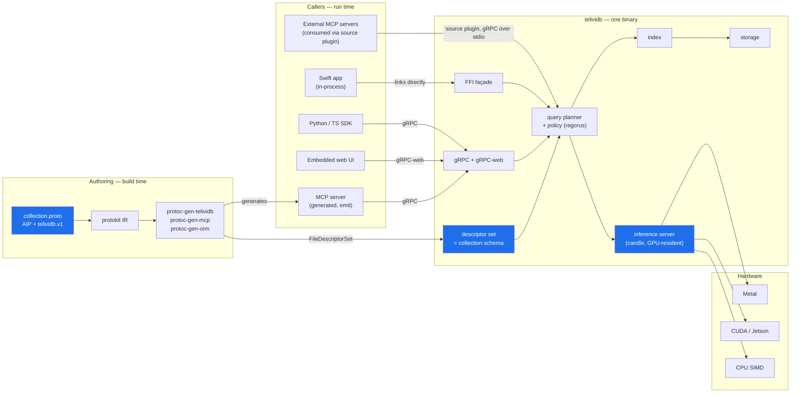
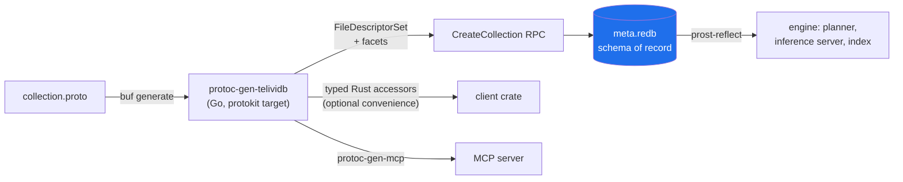
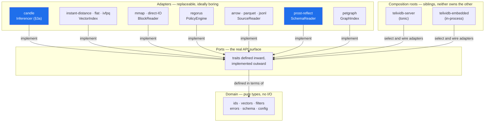
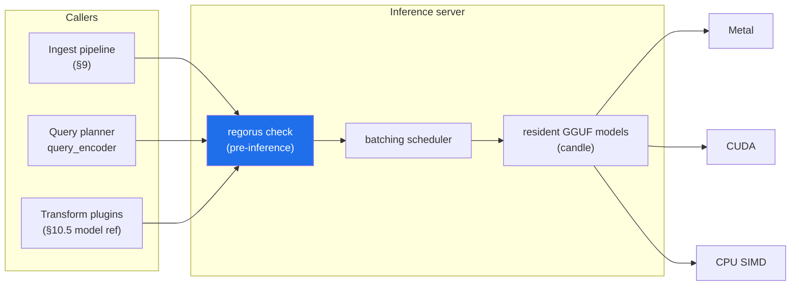
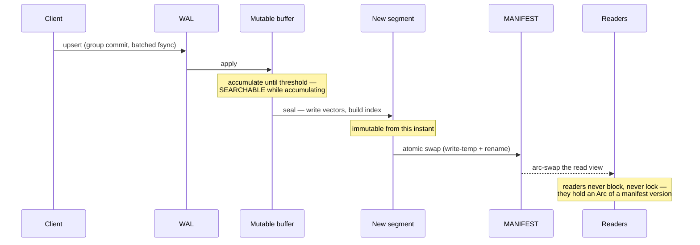
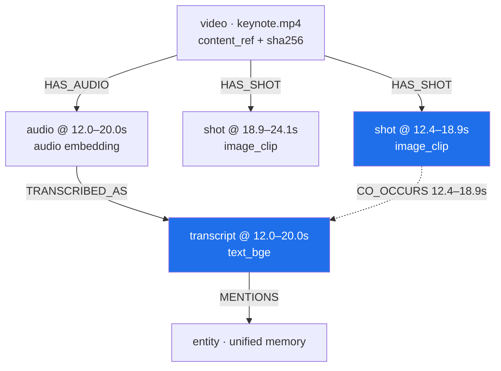
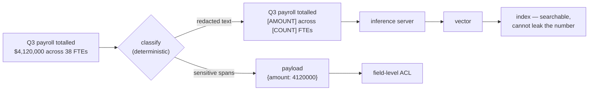
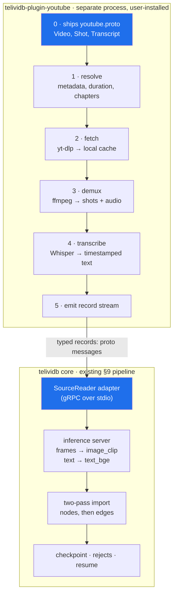
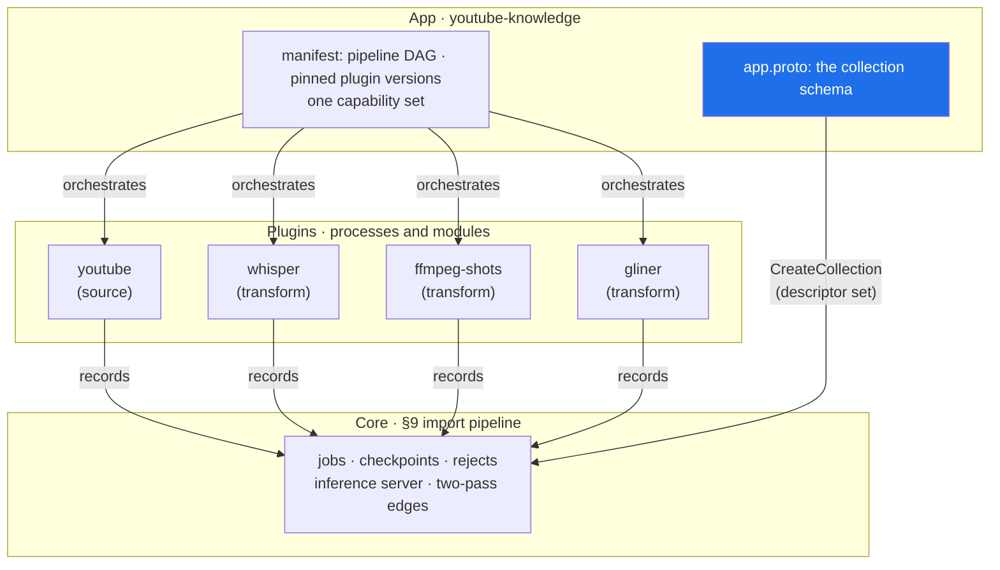

# telividb — Architecture

A single-node-first, embeddable **multimodal vector and graph database** written in Rust, with a
gRPC interface, embedding models loaded from GGUF and run **only** through `candle`, and pluggable
search algorithms — whose **schema is a `.proto` file**.

telividb is a member of [The Protobuf Project](https://the-protobuf-project.org) ecosystem. It is
the vector-and-graph projection of the same annotated `.proto` that already yields the Postgres
schema, the Prisma project, the GORM stores, the on-chain contracts and the MCP tool surface. That
relationship is not decoration; it is §2, and it constrains the segment format, the query planner,
the plugin system and the app layer.

This document consolidates the design as it stands. `CLAUDE.md` holds the working rules;
`AGENT_START.md` holds the phased plan and the detailed rationale.

**Read in this order if you are new:** §1 (what this is) → §2 (the schema layer, because everything
downstream assumes it) → §2.8 (the API surface — every service and message follows this shape) →
§3a (the inference server, because policy and plugins both hang off it) → §15 (the honest list of
what has *not* been decided) → §17 (where to start building). §19 records what changed in this
revision and why, and is the fastest way to diff this against the previous draft.

---

## 1. What this is

Three properties define the system; everything else follows from them.

**Bring your own schema.** A collection is defined by an AIP-annotated `.proto`. Point types, edge
types, payload columns, named vector fields, temporal spans, content references and per-field
permissions are all annotations. There is no second schema language and no TOML fallback — this is
a hard commitment, and §2.5 lists what it removes from the design.

**Bring your own embedding model — GGUF only.** Point a schema at a GGUF file. Inference runs
inside the database, through `candle`, on whatever accelerator the host has — Metal, CUDA, CPU
SIMD. There is deliberately **no second inference runtime.** ONNX Runtime (`ort`) was evaluated and
rejected for v1: it is a second C++ dependency tree, doubles the hardware-backend surface
(execution providers vs. `candle-metal`/`candle-cuda`), and buys coverage only for models that
don't yet have a candle path. Where GGUF/candle genuinely has no path — voice speaker embeddings
being the concrete example, §16.5 — the honest answer is "not in v1," not "fall through to ONNX."

**Bring your own search algorithm.** ANN indexes sit behind a trait. The bundled ones are not
privileged, but they stay **compile-time only** — see §10.1 for why this is non-negotiable rather
than a placeholder.

Plan A is the vector store. Plan A1.1 layers a property graph over the same storage — which is also
what joins modalities (§5), making this a general retrieval substrate for agents rather than a text
index with extras.

**Target scale for v1 is 100M+ vectors, server-first.** Embedded mode (§12) is a first-class
deployment, not the only one. That answer is load-bearing: it means real ANN is required rather than
optional, in-memory HNSW may not suffice at the top of the range, and the distribution rules in §14
must stay open rather than be deleted.

**Policy is not deferred.** Earlier drafts of this project treated per-field permission
*enforcement* as Phase 6 work, with only the schema vocabulary landing early. This revision pulls
enforcement forward: `regorus` runs for real from the first vertical slice, both at the query
planner (§7) and at the inference-server boundary (§3a). The reference plugin this document is built
around (§16b, OCEAN personality inference) writes into a permissioned, vault-eligible field on day
one specifically to force this to be true rather than assumed.



---

## 2. The schema is the index

This is the section that distinguishes telividb from every other vector store, and the one that
most constrains the rest of the document. Read it before §4.

### 2.1 Why the schema comes from a `.proto`

The ecosystem thesis is that a `.proto` annotated with Google AIP already states what a resource is,
which fields are required, and how resources relate — and that the database, the API, the tool
surface and the on-chain state are all *projections* of that one statement rather than four
independent restatements of it. protokit does the backend-agnostic work once: it walks the
descriptor set, honours the AIP annotations, and builds a normalized IR of databases, tables,
columns, relations, enums and indexes. A generator supplies only two things — how to read its own
annotations, and how to render.

There is no vector-and-graph projection in that ecosystem. telividb is it.

The practical consequence is that **a property the previous draft had to invent, telividb now
inherits**:

| The design needed | Where it now comes from |
|---|---|
| A typed graph ontology (was Gap 16) | AIP resources are node types; `resource_reference` fields are edges |
| Namespaced, additive ontology fragments (was §8.6) | Proto packages — already namespaced, already additive, already linted |
| A filter expression language (was `FilterExpr`) | **AIP-160**, which the ORM target already emits |
| A schema-version fingerprint for segments | The descriptor-set hash, mirroring the `SCHEMA_VERSION` pattern the web3 generator uses to refuse a drifted contract |
| An MCP bridge (was one box in §1) | `protoc-gen-mcp`, which already emits a Rust server, plus an MCP-consuming source plugin (§10.10) |
| Schema-evolution rules | Protobuf's own compatibility rules |

### 2.2 `telividb.v1` — the facet vocabulary

Following the ownership lesson protokit learned the hard way — the neutral naming vocabulary
`entity.v1` lives in the `store` repo, not in protokit, because a persistence-shaped vocabulary
inside a neutral engine makes the neutral engine a persistence engine — **`telividb.v1` lives in
the telividb repo, under `protobuf/annotations/telividb/v1/`, and nowhere else.** This resolves
what was an open question in earlier drafts: the annotation vocabulary is not a business schema
and does not live alongside one. Every actual collection schema — voice, OCEAN, and any
third-party plugin's `.proto` — lives under `protobuf/schemas/` in this repo, or in the plugin's
own repository, and *imports* `telividb.v1` rather than extending it. The vocabulary is published
to the buf registry from `protobuf/annotations/` specifically, and ships its reader as a nested
module that imports protokit and nothing else from telividb, so a plugin author can depend on the
annotation vocabulary alone without pulling in the vector database itself.

`telividb.v1` reads *only* what is specific to vector and graph retrieval. Names, tables, columns,
relations and indexes come from `entity.v1` and AIP, via the same reader every other generator uses.

```protobuf
option (entity.v1.datasource) = { database: "media" };

// A node type. One AIP resource == one point type.
message Shot {
  option (google.api.resource) = {
    type:    "media.telividb.dev/Shot"
    pattern: "recordings/{recording}/shots/{shot}"
  };
  option (entity.v1.table)     = { id: ID_STRATEGY_ULID, timestamps: true };
  option (telividb.v1.point)   = { collection: "media" };

  // AIP resource name — the external identity (§9, rule 1).
  string name = 1 [(google.api.field_behavior) = IDENTIFIER];

  // A resource_reference IS a graph edge. No separate edge declaration.
  string recording = 2 [
    (google.api.resource_reference) = { type: "media.telividb.dev/Recording" },
    (telividb.v1.edge) = { type: "HAS_SHOT", direction: INBOUND, on_dangling: DEFER }
  ];

  // Temporal span (§5.2) — makes this point addressable as a moment.
  telividb.v1.Span span = 3 [(telividb.v1.span) = { unit: MILLISECONDS }];

  // Content reference, not the blob (§5.3).
  telividb.v1.ContentRef content = 4 [
    (telividb.v1.content_ref) = { inline_below_bytes: 4096, hash: SHA256 }
  ];

  // A named vector field. Everything the index and the embedder need.
  // model MUST be a GGUF file — see §1 and §5.5. There is no `format` choice.
  bytes image_clip = 5 [(telividb.v1.vector) = {
    model:         "siglip-base-patch16.gguf"
    dim:           512
    metric:        COSINE
    quantize:      SQ8
    index:         HNSW
    query_encoder: "siglip-base-patch16.mmproj.gguf"   // the text tower — see below
    permission:    "vector.image_clip"                 // Gap 11, now expressible
  }];

  // Redaction is declared, deterministic, and enforced in core (§7).
  string caption = 6 [(telividb.v1.redact) = { rules: ["AMOUNT", "PERSON"] }];

  // Time-to-live — optional, per-point or per-collection default (§8.8).
  option (telividb.v1.ttl) = { default_seconds: 0 };  // 0 = no expiry
}
```

**`query_encoder` is the highest-value annotation in the set.** §5.1 observes that searching an
image field with a text query must encode that text with the joint model's *text tower*, and that
getting it wrong yields silently garbage results rather than errors. As a runtime convention that is
a permanent footgun. As a field annotation it is checkable by the AIP linter in CI and visible in
the VS Code proto tree, before a single vector is written.

### 2.3 What the target reads from the IR, and what it ignores

`protoc-gen-telividb` is an ordinary protokit generator: a facet reader, a layout resolver, and a
target. It projects the neutral IR as follows.

| IR node | Projected to | Notes |
|---|---|---|
| Database / schema | Collection | Same name the ORM target derives — enforced by `golden.IRAgreement` |
| Table | Point type | One AIP resource, one node type |
| Column (`schema.FieldType`) | `payload.arrow` column | Neutral type projected onto Arrow, exactly as Postgres projects onto SQL |
| Relation (FK / `resource_reference`) | Edge type | Direction and dangling policy from the `telividb.v1.edge` facet |
| Index | Payload filter index | Feeds selectivity estimation (§6) |
| `id_strategy`, `timestamps` | External identity, audit columns | See §2.4 on the ids.bin consequence |
| **Ignored** | SQL types, DDL, migrations, referential actions | Storage-specific to the relational target |

**Run `golden.IRAgreement(t, caseDir, ormPlugin, telividbPlugin)` in CI.** That harness builds the IR
under both plugins' readers and asserts identical database, schema, table and column names plus key
resolution, naming the diverging node on failure. `golden.Determinism` applies equally — generating
twice and byte-comparing catches the map-ranged-into-output bug a committed golden file cannot.

### 2.4 The descriptor set *is* the collection schema, at runtime

This is the crux design decision, and it resolves the Go/Rust split.

protokit is a Go library. telividb is Rust. Generated-at-build-time Rust structs cannot be the whole
answer, because a caller creating a collection at run time cannot recompile the database. So:

> **The engine never parses `.proto`. It consumes `FileDescriptorSet` bytes only.**

`CreateCollection` takes a serialized `FileDescriptorSet` plus the `telividb.v1` facets carried as
extensions on it. That blob is stored in `meta.redb` and is the authoritative schema. The Rust side
needs descriptor reflection (`prost-reflect`), not a reimplementation of protokit.



Three consequences worth stating plainly:

**External identity becomes an AIP resource name, not an opaque u64.** §9's rule that external IDs
are the only portable identity now has a concrete form: `recordings/kn24/shots/00412`. Internally,
`ids.bin` still holds fixed-stride u64 ordinals — they key an interned resource-name dictionary in
`meta.redb`. This is a **Phase 1 segment-format change** and the reason §2 must be settled before
§4 is implemented.

**Segments carry a schema fingerprint.** `header.bin` gains `schema_fingerprint` — the hash of the
canonicalized descriptor set — plus a *per-vector-field* `model_fingerprint`. A segment whose
fingerprint differs from the collection's current one is readable if the difference is additive and
rejected otherwise.

**Schema evolution is protobuf's problem, already solved.** Adding a field means new segments carry
it and older ones do not — which the presence bitmap (§5.1) already handles. Removing a field means
`reserved`. Changing a vector field's model is *a new field*, not a mutation.

### 2.5 What this deletes

| Removed | Replaced by |
|---|---|
| `[emits] node_types / edge_types` in the plugin manifest (old §8.4) | The plugin ships a `.proto`; its package *is* the namespace |
| Ontology fragments and their composition rules (old §8.6, §9.5) | Proto packages — namespaced and additive by construction |
| `[collection]` and `[ontology]` blocks in the app manifest (old §9.1) | The app ships a `.proto` |
| A bespoke `FilterExpr` type, parser and fuzzer | AIP-160 |
| A hand-written MCP bridge | `protoc-gen-mcp` |
| A second inference runtime (ONNX/`ort`) | `candle` only — see §1, §5.5 |
| **Gap 16** (typed graph ontology) | Resolved |
| Half of **Gap 11** (per-field permissions) | The `permission` field annotation; enforcement now real, not deferred |

### 2.6 AIP-160 is the filter language, with one documented extension

§6's planner takes a metadata predicate. That predicate is AIP-160, the same filter grammar the GORM
target already emits.

**The known gap: AIP-160 has no interval-overlap operator**, and §5.2's temporal spans need one
(Gap 9). AIP-160 admits function calls, so the extension is expressible —
`span.overlaps(12400, 18900)`, `span.contains(t)`, `span.within(other)` — defined once with the
planner in Phase 5, not accreted.

Policy interacts here too: whether `regorus`'s residual policy lowers into AIP-160 (§18) is now a
Phase-1-relevant question, not a Phase-6 one, because enforcement is no longer deferred.

### 2.7 What the integration costs

- **A second toolchain in the authoring loop.** `buf` and Go are needed to author a schema, though
  not to `cargo build` the engine.
- **runtime-rs is client-side today.** telividb would be the first serious Rust *server* in the mesh.
- **`store.Driver` fits the CRUD half only.** Nearest-neighbour search does not, and should not be
  bent into it.
- **`CreateCollection` now takes a blob a human cannot hand-write.** The CLI must make
  `buf generate && telividb collection create` a one-liner.

### 2.8 The API surface — AIP-compliant, and Lego-like by construction

*(New in this revision.)* Every RPC telividb exposes — generated or hand-written — passes the
Google AIP linter with **zero suppressions** (CLAUDE.md rules 37–38 are the enforcement mechanism;
this subsection is the design that makes passing possible rather than a fight). That is not
cosmetic. AIP compliance is what makes the surface **composable the way Lego bricks are**: small,
individually-complete primitives with a fixed connector shape (resource name, standard method
verbs, standard pagination/filtering), plus a small number of larger assemblies built *only* by
snapping those primitives together server-side — never a second, parallel implementation of the
same behavior.

**Two tiers, one contract.**

| Tier | What it is | Stability | Who calls it |
|---|---|---|---|
| **LLD — low-level detail** | One resource, one AIP-standard method (Get/List/Create/Update/Delete) or one AIP-136 custom method (`:search`, `:traverse`). Generated 1:1 from the descriptor set. | The stable, load-bearing surface. Changes follow protobuf compatibility rules (§2.4) — additive only. | Plugins, SDKs, MCP tool calls, and every TLD RPC internally. |
| **TLD — top-level design** | A composed operation spanning several resources — installing an app (§11), running a pipeline, provisioning a collection *and* its first job in one call. | Convenience surface. Freer to evolve, because it has no internal state of its own — see the rule below. | End users, the CLI, the embedded UI. |

**The rule that keeps the two tiers honest:** *a TLD RPC's implementation is a composition of LLD
RPC calls made in-process, never a parallel code path.* This is the same discipline §11.1 already
states for the app layer ("apps compose; plugins compute") generalized to the whole API: if
`AppsService.InstallApp` did anything `CollectionsService.CreateCollection` +
`JobsService.CreateJob` (§9) couldn't already do individually, the LLD surface would be
incomplete, and the fix is to complete the LLD surface — not to let the TLD RPC accumulate private
behavior nobody else can reach. This is what "build things on top" actually requires: anyone
bypassing the TLD convenience layer and calling LLD directly must be able to reconstruct exactly
what the TLD layer does, because that's all the TLD layer is doing.

**Resource naming follows AIP-122 all the way down, including sub-resources.** A point type's
resource pattern is declared once, in the `.proto` (§2.2's `google.api.resource` annotation), and
every service, message, and generated MCP tool (§10.10) reads that same pattern rather than
restating it:

```
collections/{collection}                                       # the schema container (§2)
recordings/{recording}                                          # a point-type resource (§16.2)
recordings/{recording}/shots/{shot}                              # sub-resource, one level down
recordings/{recording}/utterances/{utterance}                    # sub-resource (voice slice)
people/{person}/profiles/{profile}                                # sub-resource (OCEAN slice, §16b)
jobs/{job}                                                        # bulk operation, LRO-backed (§9)
collections/{collection}/grants/{grant}                           # policy grant (§7.1)
plugins/{plugin}                                                  # installed plugin instance (§10)
apps/{app}                                                        # installed app instance (§11)
```

Edges are **not** a separate CRUD resource — per §2.1/§10.3 they are `resource_reference` fields
on the child resource (a `Shot`'s `recording` field *is* the `HAS_SHOT` edge), so there is no
`.../edges/{edge}` pattern to maintain and no risk of the edge's CRUD surface drifting from the
node's. Graph traversal is exposed as a custom method (`:traverse`) on the resource being
traversed *from*, not as a resource of its own.

**Standard methods (AIP-131–135) are generated, not hand-written, for every point type.**
`protoc-gen-telividb` (§2.3) emits a typed service per AIP resource declared in the collection's
`.proto` — this is a new row in §2.3's IR-projection table:

| IR node | Projected to (added this revision) | AIP |
|---|---|---|
| AIP resource (point type) | A generated service with `Get<Type>`, `List<Type>`, `Create<Type>`, `Update<Type>`, `Delete<Type>` | 131, 132, 133, 134, 135 |
| — | `List<Type>` takes `parent`, `page_size`, `page_token`, `filter` (AIP-160, §2.6) and returns `next_page_token` | 132, 158, 160 |
| — | `Create<Type>` takes `parent` + resource body, honors `IDENTIFIER`/`OUTPUT_ONLY` field behavior (§2.2) | 133, 203 |
| — | `Update<Type>` takes an `update_mask`, never a full-resource overwrite | 134 |
| Vector field with `permission` | `read_vector` gated separately from `Get`/`List` (§7) — a distinct method, not a response field toggle | 131 + telividb's own permission model |

**Custom methods (AIP-136) cover everything that isn't CRUD**, using the same colon syntax the
linter expects:

- `:search` — nearest-neighbour search on a named vector field, including the mixed
  structured+graph+vector queries §16b.1 exercises. Takes the AIP-160 filter, a `query_encoder`
  override where relevant (§5.1), and `k`.
- `:traverse` — graph traversal from a given resource, hop count, edge-type filter, visibility
  re-checked per hop (§7).
- `:batchCreate` / `:batchGet` (AIP-233/234) — small, synchronous multi-resource operations,
  distinct from the durable-job path in §9, which is for anything too large to fit a single RPC
  deadline.

**Bulk operations are exposed as AIP-151 long-running operations, not a bespoke job API.** §9's
"durable jobs, not RPCs" is more precisely: not a *synchronous* RPC — the job itself is still
reached over gRPC, as a standard `Job` resource (`jobs/{job}`) returned immediately by the
triggering call and polled/watched via the standard `google.longrunning.Operations` service. This
means checkpoint/resume/cancel (§9, §10.2) are the *same* mechanism the AIP ecosystem already has
tooling for, rather than an telividb-specific polling convention every SDK has to learn separately.

**Why this matters for "build things on top."** Because the LLD surface is generated, standard,
and complete — never missing a capability the TLD layer secretly has — a third party can compose
their own TLD-equivalent (their own app layer, their own orchestration) using nothing but the LLD
primitives, with the same guarantees telividb's own `AppsService` has. That is the concrete
meaning of "Lego-like": the bricks that ship in the box are the same bricks the official sets are
built from.

---

## 3. Structural principles

The codebase is **ports and adapters**, applied for practical benefit rather than doctrine, with a
hard rule that **no file exceeds 200 lines** including documentation. Both are enforced in CI
(`cargo xtask check-len`, `check-layers`).

Dependencies point **inward**. `core` knows about no I/O. Adapters plug in from outside and are
wired exactly once, in a composition root.



**Why the two composition roots are siblings:** the Swift API links `telividb-embedded` with no
server present. If `telividb-server` were the parent, embedding would drag in tonic and tokio for
nothing — and anything enforced only in the gRPC handlers would be bypassable. That observation
drives §7.

**`SchemaReader` is a port, not a core type.** Descriptor reflection is I/O-shaped and version-bound;
core sees a resolved `CollectionSchema` of pure domain types.

**`GraphIndex` (`petgraph`) is in-memory, rehydrated from `meta.redb` edge records on collection
load.** This is a stated capacity assumption, not an oversight: at very large, dense-edge
collections this becomes RAM-bound before the vector side does. §15 Gap 21 tracks the upgrade path
(a persisted CSR structure) as a known, deferred cost rather than a silent one.

**The workspace groups crates by which layer of this diagram they belong to** —
`crates/domain/`, `crates/adapters/`, `crates/platform/`, `crates/bin/` (CLAUDE.md's *Workspace
layout*) — not as a filing convenience but because every crate under `domain/` and `adapters/` is
meant to be independently publishable under the project's own GitHub org, the same way this
project itself depends on independently-published `protokit`, `regorus`, and `candle`. A crate
that quietly reaches into `telividb-server` internals cannot be published alone, so that boundary
is checked in CI (`cargo xtask check-layers`) rather than left to code review discipline.

---

## 3a. The inference server

*(New in this revision — implied but never named in the previous draft's `EMB` box.)*

Every embedding call, every `query_encoder` invocation, and every plugin's compute step (§10.1,
§10.5) funnels through one component: the **inference server**. It is not a plugin and not
optional — it is core, the same way the query planner is core.

**One runtime, one trait.** `candle-core` + `candle-nn`, loading GGUF weights, dispatched to
`candle-metal` or `candle-cuda` depending on host hardware, behind a single `Inferencer` trait.
There is no second backend to schedule, batch, or reason about — see §1 for why ONNX was rejected.

**GPU-resident, not GPU-on-demand.** Model weights load once and stay resident for the life of the
process (or until evicted under memory pressure); inference calls are dispatched and batched across
concurrent callers rather than reloading weights per request. This is where most of the real
throughput comes from, and it is why the inference server is a scheduler, not a thin wrapper around
`candle::forward()`.

**Every plugin's compute step is a call *into* this server, never an independently-loaded model.**
A transform plugin (OCEAN scoring, entity extraction, reranking) declares a `model = { path, sha256
}` in its manifest (§10.5) and calls the inference server with that reference; it never opens the
GGUF file itself. Concretely this means:

- Plugin sandboxing (§10.6) never has to reason about GPU access per plugin — plugins have no direct
  device access at all.
- GPU scheduling, batching, and memory budgeting exist in exactly one place.
- Model provenance (§2.4's fingerprinting) is enforced at one call boundary, not scattered across
  every plugin that happens to embed something.

**Policy is enforced here too, not only at query time.** A call into the inference server that would
process data behind a `vector.<field>` permission scope (§7.1) is checked by `regorus` *before* the
model runs — this is an earlier, stronger checkpoint than the query-time visibility predicate in §7,
because it stops a plugin from ever producing a vector for data it wasn't allowed to touch, rather
than only hiding the vector afterward.

**Multi-model residency is required, not deferred.** A single collection reasonably has several
GGUF models resident at once — a text embedder, an image encoder, a rerank model, the OCEAN model
(§16b) — so the inference server must budget VRAM across simultaneously-loaded models from Phase 1,
not assume one-model-at-a-time. This is a real cost (see §15 Gap 22) but swapping models per call
would make the reference OCEAN slice (which needs an embedder *and* a scoring model in the same
pipeline) unworkably slow.



---

## 4. Storage

Segments are **immutable once sealed**, memory-mapped, and self-describing. This is the load-bearing
decision: it is what makes reads lock-free, `mmap` safe, snapshots free, and sharding possible later.

```
data/<collection>/
├─ MANIFEST                  # atomic pointer to the current segment set; swap = write-temp + rename
├─ MANIFEST.<n>              # prior versions → snapshot reads and time-travel come free
├─ wal/000123.wal            # append-only, crc32c framed, group commit
├─ meta.redb                 # schema descriptor set, resource-name dictionary,
│                            # ID map, graph edges  (pure-Rust ACID KV)
└─ segments/seg_00001/
   ├─ header.bin             # magic, version, schema_fingerprint, counts, codec, metric
   ├─ vectors/<field>/       # one directory per named vector field (§5.1)
   │  ├─ raw.bin             # full-precision vectors — fixed stride, 64B aligned   [mmap]
   │  ├─ codes.bin           # quantized codes for the wide scan                    [mmap]
   │  ├─ index.hnsw          # serialized graph, offset-addressed                   [mmap]
   │  ├─ present.roar        # presence bitmap — not every point has every field
   │  └─ model.fingerprint   # per-field model provenance (§2.4)
   ├─ ids.bin                # u64 ordinals → interned resource names in meta.redb  [mmap]
   ├─ spans.bin              # temporal spans, fixed stride                         [mmap]
   ├─ payload.arrow          # columnar attributes for filtering                    [mmap]
   ├─ ttl.bin                # per-point expiry timestamps, fixed stride            [mmap]
   └─ deletes.roar           # roaring tombstones — the one mutable sidecar
```

**Big and immutable → mmap'd flat files. Small and mutable → `redb`.** Putting vectors in an LSM
store fights the engine: it copies, compacts, and fragments the fixed-stride array that SIMD scans
depend on.

**Two-tier vectors are the highest-leverage decision here.** Scan wide and cheap over `codes.bin`,
then rescore the survivors at full precision from `raw.bin`.

**"Self-describing" now means something stronger.** A segment header names the exact schema
fingerprint it was written under, and each vector field names the exact model.

### 4.1 The write path



**The mutable buffer must be searchable.** Every query brute-force scans the unsealed buffer and
merges those hits with the segment results before top-k selection. Recall accounting must
distinguish buffer hits from index hits or recall measurement will read as noise.

---

## 5. The multimodal data model

The system is not text-only. Images, audio and video are first-class, and **the graph is what joins
them.**

| | **Shared space** | **Graph-joined spaces** |
|---|---|---|
| How | One jointly-trained model (CLIP/SigLIP) embeds image and text into the *same* space | Each modality keeps its own model, dimension and metric |
| Cross-modal retrieval | Falls out of the geometry — search images with text | Happens by **traversal**, not distance |
| Needs | A joint model to exist for your modalities | Nothing — works for any combination |

### 5.1 Named vectors — one point, several spaces

A point carries **named vector fields**, each with its own model, dimension, metric and index. Each
is a `bytes` field in the `.proto` carrying an `telividb.v1.vector` facet (§2.2):

```
point "recordings/kn24/shots/00412"
├─ vectors
│  ├─ image_clip   dim 512  · SigLIP · cosine · query_encoder: siglip text tower
│  └─ text_bge     dim 768  · bge-large · cosine · query_encoder: self
├─ span            { start_ms: 12400, end_ms: 18900 }
├─ content         { uri: "s3://…/keynote.mp4", range: …, sha256: … }
└─ payload         { speaker: "…", scene: "…" }
```

**Not every point has every modality**, so each field carries a **presence bitmap** — the same
roaring machinery as tombstones.

**Cross-modal query routing is a schema property.** The `query_encoder` annotation declares which
text tower encodes a query against a given vector field; the linter checks it; the planner has no
discretion.

### 5.2 Time is part of the identity

Media points carry a **temporal span** — an `telividb.v1.Span` field, stored fixed-stride in
`spans.bin` — and the graph expresses how spans relate across modalities:



**Design guidance on point boundaries:** use one point per *addressable retrieval unit*. Where
representations are co-extensive, one point with several named vectors; where boundaries differ,
separate points joined by edges.

### 5.3 The database does not store blobs

**Points hold a content reference, not the media** — an `telividb.v1.ContentRef`: URI, byte range,
and a content hash.

**This settles Gap 1.** Store a content reference always; inline the source only when small
(`inline_below_bytes`, per-field with a collection default). This is also how "Document" as a
database type is satisfied without the engine becoming a blob store — small text is inlined into
`payload.arrow`; anything larger stays referenced.

### 5.4 Media decoding stays outside the core

**telividb is a vector and graph database, not a media pipeline.** Image decode (`image`), audio
resample (`symphonia`, pure Rust), and video demux/frame extraction (ffmpeg) collide with the
no-C-dependencies invariant, so: **the database accepts frames, samples and vectors — not MP4s.**
Media preprocessing lives in a sibling ingest tool or a quarantined opt-in crate, the same way
`whisper.cpp` is quarantined for §16's voice slice.

### 5.5 The embedding reality is harder than for text, and candle-only makes some of it harder still

GGUF coverage for multimodal is thinner than for text, and restricting to `candle` (§1) narrows this
further versus keeping ONNX as an escape hatch:

| Modality | Practical path | Maturity under candle-only |
|---|---|---|
| Text | GGUF encoder (bge, e5, gte) via candle | Solid |
| Image | CLIP/SigLIP — GGUF vision-tower `mmproj`; candle has CLIP | Workable |
| **Audio** | **Whisper → text → text embedder**, via `whisper.cpp` (quarantined GGML) | **Solid, and the pragmatic choice** |
| Audio (direct) | CLAP-style embeddings | Thin GGUF support — deprioritized |
| Video | Sample frames → CLIP per shot | Assembled, not off-the-shelf |
| **Speaker embedding (voice biometric)** | **No candle-native path** | **Not in v1 — see §16.5, ONNX route struck** |

The audio row's insight is unchanged: transcribing then embedding text is more reliable than direct
audio embedding, and produces an independently valuable transcript.

**`RemoteEmbedder` is the only remaining escape hatch**, and its scope narrows under this revision:
it exists strictly for models with no candle-native path at all (e.g. ECAPA-TDNN for speaker
embedding, §16.5), not as a general "my model isn't GGUF" fallback — since ONNX, which used to cover
that broader case, is out of scope. A `RemoteEmbedder` call is declared like any other model
reference in `telividb.v1.vector`, so provenance is recorded identically whether inference is local
or remote, but it explicitly does **not** go through the in-process inference server's GPU-resident
scheduling (§3a) — it's a network call, and should be treated as such in latency budgets.

### 5.6 Fusion is shared machinery

Combining results across modalities is rank fusion — reciprocal rank fusion over per-field result
lists. This is the same mechanism hybrid sparse+dense retrieval needs (Gap 2).

---

## 6. Query path

| Selectivity | Strategy |
|---|---|
| < 1% pass | Build the bitmap, **brute-force** just those rows |
| 1–20% | **Filter-aware traversal** — skip excluded nodes during descent |
| > 20% | **Post-filter** with an over-fetch multiplier |

**The predicate is AIP-160** (§2.6), parsed once and lowered into a bitmap or a traversal guard.

Every plan additionally scans the unsealed mutable buffer (§4.1) and merges before top-k, ANDs in
the visibility predicate (§7) before the index runs, and excludes expired (TTL, §8.8) points —
in that order, and never after.

---

## 7. The security model

Authorization constrains the query path from the start; retrofitting it into a planner is painful,
and this revision does not defer it.

**The mechanism that matters: the visibility predicate is ANDed into the plan *before* the index
runs.** Post-filtering is not merely slower — it is a data leak.


**Policy is enforced in the query planner and the inference server, not the transport.** The gRPC
layer resolves a principal from credentials and hands it down; it makes no access decisions.
Embedded callers supply a principal too — `Principal::Owner` in the trivial case.

**Two enforcement points, one predicate logic.** §3a added a second checkpoint this revision didn't
have before: policy is checked *before* the inference server runs a model on scoped data, not only
when results are later read. Both checkpoints resolve grants through the same `regorus` evaluation
path, so there is exactly one policy engine to audit even though there are now two call sites.

**One predicate, every access path.** A row reached by three-hop graph traversal is checked by the
same predicate as one reached by top-k; visibility is re-checked at **every hop**.

`search` and `read_vector` are **separate permissions**, since embedding inversion can reconstruct
approximate source text from a raw vector. `export` is `read_vector` over everything.

### 7.1 Permission scopes are declared in the schema, and enforced from v1

Gap 11 asked for per-field permissions. The `permission` field on `telividb.v1.vector` and
`content_ref` names a scope; a grant attaches to `vector.image_clip` rather than the whole
collection. **This revision treats enforcement — lowering scopes into the visibility predicate, the
inference-server checkpoint, and per-hop re-checking — as v1 scope, not Phase 6 scope**, driven by
the OCEAN reference slice (§16b) needing it to be real.

**Node-type grants fall out too.** A grant can name `media.telividb.dev/Transcript` directly because
a node type is an AIP resource.

### 7.2 Confidentiality: the vector is the leak, and redaction is the fix



**No cryptography available to this project achieves this, and redaction achieves it completely.**
Rules are declared per field via `telividb.v1.redact`.

**A probabilistic classifier never gates a security boundary.** Regex, NER and schema-declared
sensitivity enforce. An LLM proposes labels for approval.

### 7.3 What cryptography can and cannot do

| Threat | Mitigation | Crypto? |
|---|---|---|
| Overbroad retrieval | Mandatory pre-filter, partition by collection | No |
| Payload leakage | Field projection allowlist | No |
| Vector inversion | Separate `read_vector` permission | No |
| **Similarity probing** | Ranks not scores, quantize, rate-limit, audit | No |
| Stolen disk | Encryption at rest, per-collection keys, crypto-shredding | **Yes — easy** |
| Untrusted host | TEE with attestation | **Yes — hard** |

**Encrypted search is rejected.** FHE is too slow and destroys the index; order-preserving encryption
is broken for this use; a secret orthogonal transform is obfuscation, not encryption, and must never
be described otherwise.

---

## 8. Vaults — secrecy at the user level

§7 is organizational. A **vault** is different in kind — content a *user* keeps secret, where the
question is "can the operator read it at all."

### 8.1 Say what is actually being guaranteed

| Model | Operator can read? | Server-side search? | Honest name |
|---|---|---|---|
| Row predicate `owner = principal` | **Yes** | Yes | a **private collection** — not a vault |
| Key unwrapped into a session on auth | **Only while a session is live** | Yes | a **vault** |
| Key never leaves the user's device | **No** | **No** | a **sealed vault** |

### 8.2 The wall, restated

**A vault the server cannot read is a vault the server cannot search.**

**Session-unwrapped (`mode = "session"`)** — the practical server default. Key unwrapped into
process memory for the session, destroyed at logout. **While a session is live, an operator with
memory access could read it** — state this plainly.

**Sealed (`mode = "local"`)** — the key never leaves the user's device. The natural mode for
embedded deployments (§12).

### 8.3 A vault is a collection, not a new subsystem

```toml
[collection.vault]
owner   = "users/srikanth"
mode    = "session"          # session | local
key     = "keychain://telividb/vault/srikanth"
```

### 8.4 A locked vault must be visible as a gap, not a silence

```protobuf
SearchResponse {
  repeated Hit hits      = 1;
  bool  complete         = 2;   // false — a vault was locked
  uint32 shards_answered = 3;
  uint32 shards_total    = 4;
  repeated string locked_vaults = 5;   // resource names only, never contents
}
```

### 8.5 Auto-vault — and why a probabilistic classifier is safe *here*

- **False negative** — sensitive content left *outside* the vault → a leak.
- **False positive** — innocuous content placed *inside* the vault → mild annoyance.

**Fail-secure: when uncertain, vault it.** The classifier may only ever move content *into* a vault,
never out of one.

**This is the default posture for any new field flagged `permission` scoped to sensitive-category
data**, including the OCEAN reference plugin's output fields (§16b) — routed to Private/vault
storage by default from the day the field is declared, not retrofitted once real data exists.

### 8.6 Key management is where this gets hard

- **Key loss is data loss. There is no recovery path**, by construction.
- **Recovery codes** are the only middle ground.
- **Derivation:** Argon2id from a passphrase, or the platform keychain / Secure Enclave.
- **Rotation** re-wraps the key cheaply; rotating the *underlying* collection key means
  re-encrypting segments via compaction.

### 8.7 Plugins get no vault access, ever, by default

A plugin never receives a vault key unless a user grants it explicitly, per vault, per session.
Auto-vault classification runs **in core**, never in a plugin.

### 8.8 Temporary storage — TTL as a first-class facet

*(New in this revision.)* Alongside Private/vault and Public (ordinary collections), a point or a
collection default may declare a time-to-live via `telividb.v1.ttl` (§2.2). Expiry is enforced by a
background job that:

1. Tombstones expired points immediately (visible to the query planner's TTL exclusion, §6) so they
   stop being served the moment they expire, even before physical removal.
2. Forces the same compaction/hard-delete path Gap 7 already requires for compliance purges (§15) to
   physically remove the data, rather than inventing a second deletion mechanism.

Temporary storage therefore does not add new machinery — it adds a trigger (expiry, not a user
delete request) into machinery §15 Gap 7 already requires to exist. This is the reason Gap 7 is
re-tiered from Tier 2 to a v1-blocking dependency in this revision (§15).

---

## 9. Bulk I/O

Bulk operations are **durable jobs, not synchronous RPCs** — but they are still reached over gRPC,
as standard AIP-151 long-running operations (§2.8): the triggering call returns a `Job` resource
(`jobs/{job}`) immediately, and progress, checkpointing, resume and cancellation happen through the
standard `google.longrunning.Operations` methods on it, not a bespoke polling scheme. **Partial
failure is the default** — a reject file with the raw record intact.

1. **AIP resource names are the only portable identity.**
2. **Import is two-pass.** Nodes build the resource-name→internal map; edges resolve against it.
3. **Subgraph export declares its edge policy** — `INDUCED` / `BOUNDARY` / `CLOSURE`.

**An archive carries its descriptor set.** The schema fingerprint travels with the data.

---

## 10. Plugins and extensibility

**"Plugin" is not one thing.** Extension points range from *thousands of calls per query with
zero-copy SIMD* to *spawn ffmpeg and talk to the internet for twenty minutes* to *call a GGUF model*.
No single mechanism serves all of them.

### 10.1 The taxonomy — and which mechanism each demands

| Extension point | Called | Needs | Mechanism |
|---|---|---|---|
| **Source / connector** | per job | network, subprocess, any language, no inference | **Out-of-process** |
| **Transform / enrich (compute)** | per document | a GGUF model call | **Out-of-process orchestration → inference server (§3a)** |
| **Rerank / fusion (compute)** | once per query | a GGUF model call, or pure arithmetic (RRF) | **RRF: core, deterministic. Model-based rerank: inference server** |
| **Embedder** | per batch | GPU, GGUF | **Compile-time, inside the inference server only** |
| **Index** | thousands of times *per query* | zero-copy, SIMD | **Compile-time only** |
| **Policy** | once per query, cached, plus pre-inference (§3a) | — | **Compile-time adapter (`regorus`)** |

**The governing rule for this revision: every plugin's compute step is a GGUF model call routed
through the inference server, never hand-written scoring logic and never an independently-loaded
model.** A source/connector plugin is exempt — it moves records, it doesn't compute — but the moment
a plugin produces a score, a label, or a derived embedding, that step must be a model reference
(§10.5), not arbitrary code. This has two consequences relative to the previous draft:

- **WASM's role shrinks** (§10.7) to non-model glue: formatting, simple deterministic gating,
  chunking logic that doesn't itself constitute "scoring." Rerank and classification, which the
  previous draft assigned to WASM, move to "call the inference server with a pinned model."
- **Index plugins stay compile-time, permanently**, for the same zero-copy reason as before — this
  was never in scope for the "must be a model" rule, since an ANN algorithm is not a model call, it
  is the thing being called thousands of times per query. "Bring your own search algorithm" stays
  delivered by telividb publishing as a crate (`impl VectorIndex`, build your own binary), not by a
  runtime plugin boundary.

### 10.2 The key unification: a source plugin is a `SourceReader`

A source plugin emits exactly the record stream that bulk import (§9) already consumes, inheriting
job semantics, checkpointing/resume, reject files, two-pass edge resolution, and model/schema
provenance enforcement for free. **The plugin is an out-of-process adapter behind the `SourceReader`
port that already exists — nothing new is built for plugin ingest.**

### 10.3 A plugin ships a `.proto`, not an ontology block

A plugin ships an AIP-annotated `.proto` in its own package. Namespacing is the package.
Additivity is protobuf's compatibility discipline. Collision is a compile error.

### 10.4 Worked example — the YouTube plugin, end to end



**The plugin does not embed.** It emits frames and text; the core (via the inference server, §3a)
embeds them, because that is where model provenance and redaction are enforced. A plugin that
produced vectors directly would route around both.

### 10.5 The manifest — capabilities are declared, then granted

```toml
[plugin]
name    = "youtube"
version = "0.3.1"
kind    = "source"                  # source | transform | rerank | embedder
abi     = "telividb-plugin/1"
sha256  = "9f2c…"
schema  = "buf.build/acme/youtube:v0.3.1"

[capabilities]
network       = ["youtube.com", "*.googlevideo.com"]
subprocess    = ["yt-dlp", "ffmpeg"]
filesystem    = ["$PLUGIN_CACHE"]
max_memory_mb = 4096
timeout_s     = 3600

[config]
quality       = { type = "string", default = "720p" }
whisper_model = { type = "path",   required = false }

# Required when kind = "transform" | "embedder" | "rerank" — the compute step
# MUST be a pinned GGUF model call through the inference server (§3a, §10.1).
# Absent entirely for kind = "source", which does no compute.
[model]
format = "gguf"
path   = "acme-ocean-v1.gguf"
sha256 = "4ab1…"
```

**Capability-based, deny by default.**

### 10.6 Plugins are the largest hole you can punch in the security model

1. **A plugin runs as a principal.**
2. **Plugins do not see vectors** unless granted `read_vector`.
3. **A classification plugin proposes; it never authorizes.**
4. **Hash-pinned and consented at install**, schema included.
5. **Resource-bounded.**
6. **Audited.**
7. **No plugin ever has direct GPU/model access** — all compute routes through the inference server
   (§3a), which is where the sandboxing model in this list actually holds: a plugin cannot exceed
   its declared model reference because it never touches a model file directly.

### 10.7 WASM, and where it genuinely fits — narrowed scope

For non-model glue — formatting, deterministic gating, chunking boundaries that don't score
anything — **WASM via `wasmtime` with the Component Model** is right: sandboxed, hot-reloadable,
capability-scoped. **This revision removes rerank and classification from WASM's scope** (§10.1) —
those are model calls now. What remains for WASM is smaller than the previous draft envisioned, and
it is fair to ask at Phase 5 whether it is still worth a dedicated mechanism versus folding into
core deterministic logic (RRF fusion, §5.6, already lives in core, not WASM).

### 10.8 Transport and lifecycle

Out-of-process plugins follow the Terraform-provider/containerd-shim pattern: discovered from
`~/.telividb/plugins/`, spawned as a child process, **gRPC over stdio**, ABI handshake, crash
isolation for free.

### 10.9 Recommended sequencing

| Stage | Scope | Why |
|---|---|---|
| **A** — with Phase 3 | Out-of-process **source** plugins behind `SourceReader` | Highest value, pipeline already exists |
| **A′** — with Phase 4 | **The OCEAN transform plugin (§16b)**, exercising the model-call rule end to end | Forces §3a and §7.1 enforcement to be real, not deferred |
| **B** — after Phase 5 | Remaining WASM glue — chunkers, non-model gating | Needs the query pipeline stable first |
| **C** — later | Registry, signing infrastructure | Manual install with hash pinning is fine for a long time |
| **Never** | Hot-path WASM for indexes or distance kernels | The boundary cost is the whole budget |

### 10.10 MCP as a plugin surface, both directions

*(New in this revision.)* The previous draft only had telividb *emit* MCP (`protoc-gen-mcp`
generating a server other agents call). This revision adds the consume direction, using existing
machinery rather than new:

**Emit** — unchanged in mechanism, sharper now that §2.8 exists. `protoc-gen-mcp` derives an MCP
tool surface from the same descriptor set that defines the collection, and it maps **1:1 onto the
LLD API** — one MCP tool per standard or custom method, same resource names, same filter grammar.
TLD operations (installing an app, running a pipeline) are exposed as MCP tools too, but as thin
wrappers over the LLD tools for the same reason §2.8 requires of the gRPC surface: an agent
composing its own multi-step plan from LLD tools must be able to reach exactly what a TLD tool
would have done, never a hidden shortcut. This is the "have a conversation with the vector store"
surface referenced in §16b — and it works because the tool surface has no capability the gRPC
surface lacks.

**Consume** — a `kind = "source"` plugin whose fetch step calls tools on an *external* MCP server
instead of a bespoke API (YouTube's yt-dlp, §10.4). It is a `SourceReader` like any other source
plugin: it inherits the two-pass import pipeline, checkpointing, and reject-file handling for free.
No new plugin kind, no new machinery — an MCP server is just another thing a source plugin's fetch
step can call.

---

## 11. The app layer

Plugins are capabilities. **Apps are compositions of them.**



### 11.1 Apps compose; plugins compute

**The app layer is declarative, not code.** An app is a manifest, a `.proto`, and configuration.

```toml
[app]
name    = "youtube-knowledge"
version = "1.2.0"
summary = "Make a YouTube channel or playlist searchable across video, audio and transcript."

[schema]
module     = "buf.build/acme/youtube-knowledge:v1.2.0"
collection = "media"

[requires]
youtube      = { version = "^0.3", sha256 = "9f2c…" }
whisper      = { version = "^1.1", sha256 = "4ab1…" }
ffmpeg-shots = { version = "^0.2", sha256 = "77de…" }
gliner       = { version = "^0.5", sha256 = "c019…" }

[[pipeline]]
id = "fetch"       ; plugin = "youtube"       ; action = "fetch"
[[pipeline]]
id = "shots"       ; plugin = "ffmpeg-shots"  ; after = ["fetch"] ; input = "video"
[[pipeline]]
id = "transcribe"  ; plugin = "whisper"       ; after = ["fetch"] ; input = "audio"
[[pipeline]]
id = "entities"    ; plugin = "gliner"        ; after = ["transcribe"]
[[pipeline]]
id = "link"        ; builtin = "graph.link"   ; after = ["shots", "transcribe", "entities"]

[ui]
panel = "declarative"
```

### 11.2 The pipeline is a DAG, and it inherits §9 wholesale

No bespoke workflow engine. Every step feeds the existing import pipeline.

### 11.3 One consent decision, not five

```
Install youtube-knowledge?
  network      youtube.com, *.googlevideo.com, huggingface.co
  subprocess   yt-dlp, ffmpeg
  filesystem   $PLUGIN_CACHE
  schema       creates "media" — Video, Shot, Transcript, Entity
  principal    runs as: svc-youtube-knowledge  (no read_vector)
```

### 11.4 UI panels are declarative, deliberately

Not arbitrary JavaScript. Forms, tables, charts and job views specified in the manifest, rendered by
the UI's own components (§13's `axum` + `rust-embed` daemon).

### 11.5 Sequencing

Worth building only after stage-A plugins exist and at least two real plugins are in use.

---

## 12. Embedded mode

**telividb is an embeddable library first, with a server wrapped around it.**

```swift
let db = try Telividb.open(path: "~/data", config: cfg)
let hits = try db.collection("finance").search(text: "Q3 payroll", k: 10)
```

The FFI façade stays narrow — 15–25 functions, opaque handles, `catch_unwind` at every entry point.
The inference server (§3a) runs in-process in embedded mode too, using the same GPU-resident,
policy-checked path as server mode — this is the concrete reason §3a is core rather than an adapter
behind the server composition root only.

**Hazard introduced by embedding:** two processes opening the same data directory. Take an advisory
lock at open — exclusive for writers, shared for readers.

---

## 13. Deployment

| Platform | Mode | GPU |
|---|---|---|
| Linux + NVIDIA | Container or native | CUDA ✓ (via candle-cuda) |
| Jetson (aarch64) | Container or native | CUDA ✓ |
| **macOS Apple Silicon** | **Native daemon** | **Metal ✓ (via candle-metal)** |
| macOS, any container runtime | Container | CPU only |

**macOS cannot use the GPU inside a container** — Apple GPUs have no IOMMU, `Hypervisor.framework`
exposes no virtual GPU. macOS ships as a Homebrew daemon:

```bash
brew install telividb && brew services start telividb
```

The daemon binary embeds the control-plane UI via `axum` + `rust-embed` (§11.4) and the `regorus`
policy evaluator behind a narrow internal endpoint, both in-process by default with the option to
split out later for distributed deployments (§14) without changing the enforcement model.

---

## 14. Distribution and topology

Nothing here is built in v1. **One rule keeps it open at zero cost:** segments must stay
self-contained and searchable in isolation.

**Why Macs suit this workload:** vector search is memory-bandwidth-bound. Unified memory means the
whole index is GPU-addressable with no PCIe hop.

### 14.1 Three planes, three transports

**Vector search has no partition key.** Fan-out is total; **scale by replicas, not shards.**
`SearchResponse` carries `complete` / `shards_answered` / `shards_total` from Phase 0.

### 14.2 Thunderbolt topology

| Topology | Nodes | Verdict |
|---|---|---|
| Direct pair | 2 | Trivial |
| **Full mesh** | **3–6** | **The sweet spot** |
| Daisy chain | any | Avoid |
| Beyond ~6 | — | Fall back to 10/25 GbE |

**Consensus is probably not needed.** Segments are immutable; replication is copying files and
distributing a manifest.

---

## 15. Gap analysis — what has *not* been decided

Numbering preserved from the previous draft; resolved items are struck rather than removed.

### Tier 1 — architectural forks that are costly to reverse

**1. ~~Source text retention~~ — resolved (§5.3).**

**2. Hybrid search — sparse + dense.** Still open; §5.6 lowers the cost since fusion is shared.

**3. Late interaction (ColBERT-style) — still open**, distinct from named vectors.

**18. Schema migration execution.** Still open — a migration plan derived from the descriptor diff,
executed as a durable §9 job.

**21. Graph index capacity.** *(New.)* `petgraph` (§3) is in-memory only, rehydrated from `redb` on
load. No decision has been made on when this stops being sufficient or what the persisted-CSR
upgrade path looks like precisely — it should be a stated capacity ceiling in the v1 release notes,
not a silent assumption.

**22. Multi-model VRAM budgeting.** *(New, introduced by §3a.)* The inference server requires
multiple GGUF models resident simultaneously (embedder + rerank + OCEAN-style scoring models at
minimum). No eviction/priority policy has been designed yet for when combined resident models
exceed available VRAM — this blocks any deployment with more than a couple of active named-vector
fields plus one transform plugin.

### Tier 1.5 — pulled forward from Tier 2 this revision

**7. Hard delete for compliance — now v1-blocking, not deferred.** §8.8's Temporary storage type and
the OCEAN reference plugin's vault-eligible fields (§16b) both depend on a real forced-compaction
purge path existing before, not after, Slice 1 ships. This was previously staged for "before Slices
2–3" of the voice track; it is now a Phase-1/Phase-4 dependency regardless of which slice is first.

**11. Per-field permissions — enforcement now v1 scope, not Phase 6.** Declaration was already done
(`permission` facet). This revision makes lowering scopes into the visibility predicate *and* the
new inference-server checkpoint (§3a, §7.1) part of the initial build, driven by the OCEAN slice
needing it to be real from day one.

### Tier 2 — operational gaps that surface in production

**4. Query explain.** Still open.

**5. Production recall measurement.** Still open.

**6. Backpressure and admission control.** Still open.

**8. Payload-only updates.** Still open.

**9. Temporal query semantics.** Still open — AIP-160 extension functions have syntax, not
implementation.

**10. ~~Who owns the media pipeline?~~ — resolved (§10, §11).**

**19. The descriptor set is untrusted input.** Still open — bound recursion depth, message count,
extension size.

**23. Is a personality/trait-inference GGUF model actually available and adequate?** *(New,
introduced by §16b.)* Unlike voice transcription (§16.1, "solid"), there is currently no widely
validated GGUF-native model for OCEAN-style trait inference. This is the honest equivalent of
§16.1's speaker-embedding gap: the slice may need to start with a general-purpose instruction model
prompted for structured trait output rather than a purpose-built scoring model, and that distinction
should be made explicit in the slice's own documentation rather than glossed over.

### Tier 3 — quality, process, and strategy

**12. Deterministic simulation testing.** Still open.

**13. Fuzzing the parsers.** Still open.

**14. Chunking strategy.** Still open.

**15. Reranking.** Narrower now — see §10.1; a rerank plugin is a model call through the inference
server, so this gap is really "which GGUF cross-encoder to bundle as the reference," not a mechanism
question.

**16. ~~A typed graph ontology~~ — resolved.**

**17. Licensing.** Apache-2.0, unless a specific reason.

**20. Ecosystem contract questions.** Still open.

---

## 16. First vertical slice — voice

Voice remains a strong slice for exercising schema, plugins, spans, named vectors, the graph, and
the import pipeline. Its speaker-embedding stage (Slice 2) is more constrained under this revision
than the previous draft assumed — see §16.5.

### 16.1 What is actually available

| Capability | Status | Notes |
|---|---|---|
| **Transcription** | **Solid** | `whisper.cpp` GGML weights; Metal 2–4× over CPU |
| **Distillation** | **Solid** | `distil-large-v3`, English-only |
| **Speaker embedding** | **Not available under candle-only** | ECAPA-TDNN/pyannote/WeSpeaker have no candle-native path, and the ONNX route (previously listed as an option) is struck under this revision's candle-only decision (§1). |

### 16.2 The slice, as a schema

```protobuf
package voice.v1;
option (entity.v1.datasource) = { database: "voice" };

message Recording {
  option (google.api.resource)  = { type: "voice.telividb.dev/Recording"
                                    pattern: "recordings/{recording}" };
  option (telividb.v1.point)    = { collection: "voice" };

  string name     = 1 [(google.api.field_behavior) = IDENTIFIER];
  string title    = 2;
  telividb.v1.ContentRef audio = 3 [(telividb.v1.content_ref) = { hash: SHA256 }];
  int64  duration_ms = 4 [(google.api.field_behavior) = OUTPUT_ONLY];
}

message Utterance {
  option (google.api.resource)  = { type: "voice.telividb.dev/Utterance"
                                    pattern: "recordings/{recording}/utterances/{utterance}" };
  option (telividb.v1.point)    = { collection: "voice" };

  string name      = 1 [(google.api.field_behavior) = IDENTIFIER];
  string recording = 2 [
    (google.api.resource_reference) = { type: "voice.telividb.dev/Recording" },
    (telividb.v1.edge) = { type: "HAS_UTTERANCE", direction: INBOUND }
  ];
  telividb.v1.Span span = 3 [(telividb.v1.span) = { unit: MILLISECONDS }];
  string text = 4 [(telividb.v1.content_ref) = { inline_below_bytes: 4096 }];

  bytes text_bge = 5 [(telividb.v1.vector) = {
    model: "bge-large-en-v1.5.gguf", dim: 768, metric: COSINE,
    source_field: "text", index: HNSW, permission: "vector.text_bge"
  }];
}
```

### 16.3 Three slices, in order

**Slice 1 — transcription only.** Needs nothing that is not already available.

**Slice 2 — diarization, anonymous clusters.** Where a voice embedding field first appears.

**Slice 3 — recognition, enrolled identities.** Deliberately last.

### 16.4 Voice embeddings are biometric data

Voiceprints are Article-9/BIPA-grade data. Gap 11 (permission enforcement) and Gap 7 (hard delete)
are prerequisites — and per §15 Tier 1.5, both are now v1-blocking regardless of which slice ships
first, not staged specifically "before Slice 2."

### 16.5 The speaker-embedding decision, when it arrives

| Route | Status under this revision |
|---|---|
| ~~ONNX via `ort`~~ | **Struck — candle-only, §1** |
| **`RemoteEmbedder`** | The remaining fallback; a Python sidecar running pyannote/SpeechBrain, network-call latency, does not use the in-process inference server (§5.5, §3a) |
| **Port ECAPA-TDNN to candle** | Pure Rust, keeps the invariant. Real work, tractable. |

Slice 2 is not blocked *by this document*, but it is now blocked on one of exactly two routes rather
than three, and the easier of the three (ONNX) is the one that was removed.

---

## 16b. Second vertical slice — OCEAN personality inference (the reference plugin)

*(New in this revision.)* Where §16's voice slice proves the schema/plugin/span/graph spine, this
slice proves the parts voice does not: real policy enforcement (§7.1, §3a) on a sensitive field, the
inference-server model-call rule for plugins (§10.1), and the MCP "conversation with the store"
surface (§10.10) — treating the database itself as something an agent queries and reasons over, not
only a storage backend.

### 16b.1 What this slice actually exercises, end to end

1. **Read** — a `kind = "source"` or existing-collection read step pulls text (and, if the voice
   slice has run, transcripts) associated with a `Person`/`Entity` resource.
2. **Infer** — a `kind = "transform"` plugin, per §10.1's rule, calls the inference server with a
   pinned GGUF model reference (§10.5) to produce OCEAN trait scores (openness, conscientiousness,
   extraversion, agreeableness, neuroticism) plus, where the model supports it, a short natural-
   language rationale.
3. **Write** — the five scores land as **structured payload** on an `OceanProfile` point (not a
   vector — five floats is a filterable column, per the Database/Structured branch of the mindmap,
   §5.1's `payload.arrow`). The rationale text, if produced, is separately embedded (`text_bge`) so
   *why* a score was assigned is itself searchable.
4. **Link** — a `HAS_PROFILE` edge (`resource_reference` + `telividb.v1.edge`) connects `Person` to
   `OceanProfile`, making the profile reachable by graph traversal as well as by filter.
5. **Enforce** — every OCEAN field carries `permission: "vector.ocean_profile"` (or the structured
   equivalent) from the moment the schema is written, and routes to **Private/vault storage by
   default** (§8.5's auto-vault posture, applied at design time rather than retrofitted) — because
   inferred personality/psychological trait data about identifiable individuals sits in the same
   sensitive-category bucket §16.4 already established for voiceprints, even though the underlying
   legal basis differs (profiling provisions such as GDPR Art. 22, rather than Art. 9 biometric
   identification specifically). §7.1's enforcement work is what makes this tag meaningful rather
   than decorative.
6. **Converse** — the MCP-emit surface (§10.10) exposes the enriched graph to an agent. The
   canonical test query for this slice is a mixed structured+graph+vector query — e.g. "who worked
   on the video project and scores high on openness" — which forces the query planner (§6) to
   combine a structured filter (`openness > threshold`), a graph join (`worked_on` edge), and the
   visibility predicate (§7) in one plan, exactly the mixed-modality path the architecture claims to
   support but that the voice slice alone never tests.

### 16b.2 What is actually available

Mirroring §16.1's honesty about speaker embeddings: **there is no widely validated, purpose-built
GGUF model for OCEAN-style trait scoring** (§15 Gap 23). The pragmatic v1 path is a general-purpose
instruction-following GGUF model, prompted for structured (JSON-shaped) trait output, rather than a
dedicated classifier. This is an acceptable starting point for proving the architecture — the slice
is testing the *pipeline*, not claiming clinical-grade personality inference — but it should be
stated as such in any user-facing documentation of this reference plugin, not presented as a vetted
psychometric instrument.

### 16b.3 What this slice proves that voice does not

- **Policy enforcement is real**, not declared-and-deferred — this is the one thing voice's Slice 1
  (ordinary text, no permission scope needed yet) cannot test.
- **The inference-server model-call rule** for transform plugins (§10.1, §3a) end to end, including
  the pre-inference `regorus` checkpoint.
- **Mixed structured + graph + vector queries** through the planner (§6), rather than single-field
  vector search.
- **The MCP-emit conversational surface** (§10.10) against a graph that is actually worth traversing
  (profiles linked to people linked to projects), rather than a flat transcript index.
- **Vault-eligible field design from schema-authoring time**, not bolted on after a security review.

---

## 17. Roadmap

```mermaid
flowchart LR
    P0["0 · Skeleton + schema<br/>telividb.v1, protoc-gen-telividb,<br/>CreateCollection(descriptor set),<br/>protos, CI, macOS runners"] --> P1["1 · Vector store + inference server<br/>segments, named vectors, spans,<br/>fingerprints, WAL, flat index,<br/>candle Inferencer, regorus wired in"]
    P1 --> P2["2 · Real ANN<br/>instant-distance HNSW, IVF-PQ, recall"]
    P1 --> P3["3 · Bulk I/O<br/>archives, jobs, rejects,<br/>source plugins (stage A)"]
    P2 --> P4["4 · Embeddings + enforcement<br/>GGUF via candle, distil-whisper,<br/>redact-before-embed, per-field<br/>permission enforcement (pulled forward)<br/>← SLICE 1 (voice) and SLICE 2 (OCEAN) land here"]
    P3 --> P4
    P4 --> P5["5 · Filtering<br/>AIP-160 planner, bitmaps,<br/>span functions"]
    P5 --> P6["6 · Access control (remainder)<br/>encryption at rest, hard delete<br/>(forced-compaction purge — now<br/>required by P4, not deferred to here)"]
    P6 --> P7["7 · SDKs<br/>embedded + Swift + MCP (both directions)"]
    P7 --> P8["8 · UI + apps<br/>brew daemon (axum+rust-embed),<br/>job monitor, app manifests, panels"]
    P6 --> P9["9 · Graph A1.1<br/>edges, per-hop visibility<br/>← voice SLICES 2–3 (biometric)"]
    P8 --> P10["10 · Ops<br/>snapshots, metrics"]
    P9 --> P10

    style P0 fill:#1f6feb,color:#fff
    style P1 fill:#1f6feb,color:#fff
    style P2 fill:#1f6feb,color:#fff
    style P4 fill:#1f6feb,color:#fff
```



Ordering constraints, updated for this revision:

- **Phase 0 still blocks Phase 1.** Unchanged.
- **Phase 1 now includes the inference server and a working `regorus` wiring**, not just storage —
  because §3a's pre-inference policy checkpoint has to exist before Phase 4's plugins can be tested
  meaningfully, and because a second inference runtime is no longer a Phase-4-only concern to defer
  (there is only one runtime, decided at Phase 0/1).
- **Hard delete (Gap 7) moves from "prerequisite for Slices 2–3" to a Phase 4 dependency**,
  because both the OCEAN slice's vault-eligible fields and Temporary storage (§8.8) need it at the
  point Slice 1/2 land, not later.
- **Per-field permission enforcement (Gap 11) moves from Phase 6 into Phase 4**, driven by the same
  slice. Phase 6 keeps encryption-at-rest and the remaining hard-delete plumbing, but the
  policy-predicate and inference-server enforcement itself ships earlier.
- **Voice Slices 2–3 still wait for Phase 6/9**, unchanged, since biometric recognition is a strictly
  harder bar than OCEAN's structured-payload case.

---

## 18. Open questions

**Blocking the schema layer (Phase 0):**
- ~~Where does `telividb.v1` live, exactly?~~ **Resolved this revision (§2.2):**
  `protobuf/annotations/telividb/v1/`, physically separate from `protobuf/schemas/`, published to
  buf from that path.
- Does telividb implement `store.Driver` for its CRUD half?
- Is `golden.IRAgreement` wired between the ORM and telividb generators in CI?
- What does `CreateCollection` accept, precisely?

**Blocking the segment format (Phase 1):**
- Late interaction: commit or defer?
- Interned resource names: dictionary in `redb`, or a per-segment string column?
- Migration plan format?
- Scale target within the 100M+ band?
- English-only acceptable for Slice 1?
- **New — does `petgraph`'s in-memory model need a persisted-CSR fallback before Phase 1 ships, or
  can that be an explicitly stated v1 limitation?** (§15 Gap 21.)
- **New — what is the VRAM eviction policy when the inference server's resident model set exceeds
  available memory?** (§15 Gap 22.)

**Blocking Phase 4 (moved up from Phase 6):**
- **Does `regorus` support partial evaluation for the inference-server checkpoint specifically**,
  not only the query-planner checkpoint? This is now two call sites needing the same answer, not
  one.
- What is a principal? API keys only, or mTLS / OIDC?

**Strategic:**
- Licence? Apache-2.0 unless a specific reason.
- Is hybrid sparse+dense in scope?
- Which plugins are first-party — voice and OCEAN are now both named; are there others?
- **Is a purpose-built OCEAN-scoring GGUF model worth sourcing/fine-tuning, or does v1 ship on a
  prompted general model indefinitely?** (§15 Gap 23.)
- Which vault mode is the default?
- Are recovery codes offered?
- Is consent tracking in scope — now relevant to OCEAN's profiling data, not only voice biometrics?
- Do apps get a marketplace, ever?
- Do Intel Macs matter?

---

## 19. What changed in this revision

**Four decisions were taken, and everything below follows from them:**

1. **Inference is candle-only.** ONNX Runtime (`ort`) is out of scope for v1 — no second C++
   dependency tree, no second hardware-backend surface. Where candle has no path (speaker
   embedding), the honest answer is "not in v1," not "fall through to ONNX."
2. **Policy enforcement is real from v1, not deferred to Phase 6.** Both the query-planner
   visibility predicate and a new pre-inference checkpoint at the inference server enforce
   `regorus`-evaluated scopes from the first vertical slice onward.
3. **A named, core inference server exists** (§3a) — GPU-resident, multi-model, the single call
   path for ingest embedding, query-time encoding, and every plugin's compute step. Plugins never
   load models directly.
4. **A second reference slice, OCEAN personality inference (§16b), is added alongside voice**,
   specifically because it exercises real policy enforcement and mixed structured+graph+vector
   queries in a way the voice slice's plain-text Slice 1 does not.
5. **The gRPC API surface is formalized as AIP-compliant and two-tiered** (§2.8) — generated
   per-resource standard methods (LLD) plus a small set of composed operations (TLD) that are
   required to be implemented *only* by calling the LLD methods server-side, never a parallel code
   path. This is what makes the surface something third parties can build their own composition
   layer on top of, using the same primitives telividb's own app layer uses.

**Added:**
- §2.8 — the AIP-compliant, two-tier (LLD/TLD) API surface: resource naming down to sub-resources,
  generated standard methods, AIP-136 custom methods (`:search`, `:traverse`), and bulk operations
  reframed explicitly as AIP-151 long-running operations rather than a bespoke job API.
- §3a — the inference server as a named core component.
- §8.8 — Temporary storage / TTL as a first-class facet.
- §10.10 — MCP consumption (not just emission) as a source-plugin pattern.
- §16b — the OCEAN reference slice, in full, parallel to §16's voice slice.
- Gaps 21 (graph index capacity), 22 (multi-model VRAM budgeting), 23 (OCEAN model availability).
- A locked-stack appendix (§20) naming the concrete crates this revision commits to.

**Removed / struck:**
- ONNX/`ort` as an inference path anywhere in the document, including as the primary
  speaker-embedding fallback in §16.5.
- WASM's role for rerank and classification (§10.7) — those are model calls through the inference
  server now.
- The framing of per-field permission enforcement and hard delete as "Phase 6 work" — both are
  pulled forward and re-tiered in §15 and §17.

**Renumbered / retiered:** Gap 7 and Gap 11 move from Tier 2 to a new Tier 1.5 ("pulled forward this
revision") to make the schedule change visible without renumbering the whole gap list.

---

## 20. Locked stack (this revision)

Concrete crate choices, so implementation doesn't re-litigate architecture decisions already made
above.

| Component | Crate(s) | Notes |
|---|---|---|
| Transport | `tonic`, `prost`, `prost-reflect` | gRPC + descriptor reflection for runtime schemas |
| Metadata / small mutable KV | `redb` | Pure-Rust ACID KV; schema, resource-name dict, ID map, edges |
| In-memory graph | `petgraph` | Rehydrated from `redb` on load; see Gap 21 for capacity ceiling |
| Vector index | `instant-distance` (default HNSW), hand-rolled flat/IVF-PQ | Pure Rust, zero-copy, no C FFI on the hot path. FAISS, if ever added, is an optional quarantined feature — never default. |
| Inference | `candle-core`, `candle-nn`, `candle-metal`, `candle-cuda` | GGUF only, one runtime — see §1, §3a, §5.5 |
| Policy | `regorus` | In-process OPA/Rego; enforced at query planner (§7) and inference server (§3a) |
| Columnar payload | `arrow-rs`, `parquet` | `payload.arrow`, structured/Document field storage |
| Embedded UI + control plane | `axum`, `rust-embed` | Shares hyper/tower stack with `tonic`; declarative panels only (§11.4) |
| Non-model plugin glue | `wasmtime` (Component Model) | Narrowed scope per §10.7 — no rerank/classification here anymore |
| Out-of-process plugins | `tonic` over stdio | Same RPC stack as everything else, no second transport |

**Explicitly not in the v1 stack:** `ort` / ONNX Runtime; FAISS as a default index; any second
inference runtime or hardware-execution-provider system beyond `candle`'s Metal/CUDA backends.