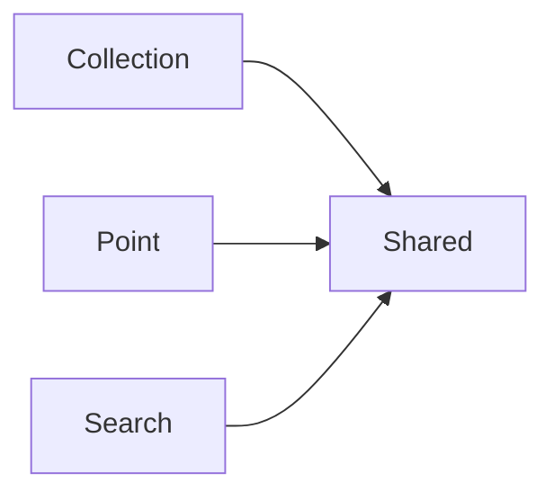

<!-- Generated by `cargo xtask protodoc`. Do not edit. -->

# Protobuf API

One package per resource, each in its own versioned directory. Files within a package are split by role: the resource, its request and response messages, and its service.

| Module | Package | Services | Messages | Enums |
| --- | --- | ---: | ---: | ---: |
| [Collection](episteme/collection/README.md) | `episteme.collection.v1` | 1 | 7 | 0 |
| [Point](episteme/point/README.md) | `episteme.point.v1` | 1 | 9 | 0 |
| [Search](episteme/search/README.md) | `episteme.search.v1` | 1 | 6 | 0 |
| [Shared](episteme/shared/README.md) | `episteme.shared.v1` | 0 | 3 | 3 |

## Module dependencies

